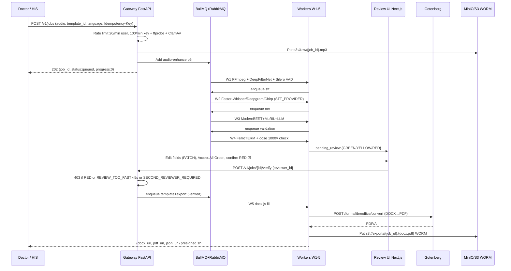
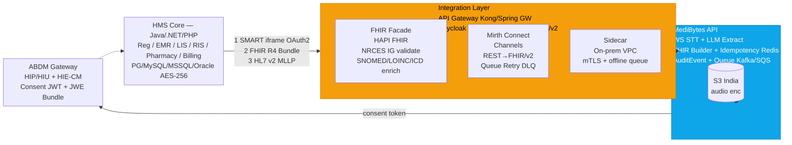
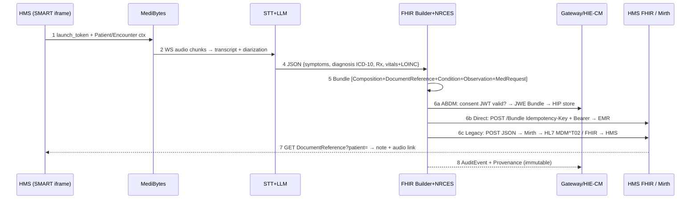

# MediBytes — Pipeline & HMS Integration Architecture Report

> **Version:** 1.0 | **Date:** 2026-09-17 | **Source:** `PRODUCTION_PLAN_L7.md:1-904` + `ARCHITECTURE.md` + `IDEA.md` + `EDGE_CASES.md`
> **Target:** 99% Field Accuracy | 99.9% Availability | Scale 1 → 1000 machines (Cloud + Air-Gapped Local) | Languages en-IN/hi-IN/ta-IN + Hinglish/Tanglish
> **Invariant:** `No DOCX/PDF exports until human verifies every field. POST /v1/.../export → 403 if status != verified` — `L7.md:5,322,395`

---

## 1. Executive Summary

MediBytes is an 8-stage clinical voice-to-template pipeline: **record (EN/HI/TA code-mix) → clean → transcribe → normalize → extract entities → validate (99% gate) → mandatory human verify → fill template → export DOCX/PDF/FHIR**. One artifact `medibytes:1.0.0` (SHA256 pinned) runs both **Cloud (EKS + A10G/L4 + RDS/S3/ElastiCache)** and **Local (Docker Compose + postgres:16-alpine/minio/redis:7-alpine + T4/CPU)** switched by `STT_PROVIDER`/`VALIDATOR` (`L7.md:41`).

HMS integration is **never direct DB writes**. MediBytes exposes a **FHIR R4 + OpenAPI 3.1** API behind an **Integration Layer (API Gateway + FHIR Facade + Mirth/Adapter + optional Sidecar)**. Four paths cover 95% of Indian hospitals (legacy PHP/.NET → modern Java/Spring Bahmni/OpenMRS/eHospital NextGen):

| Path | For | Protocol |
|---|---|---|
| **A. Direct FHIR** | Bahmni / OpenMRS 3 / NextGen eHospital / Eka | `POST /fhir/R4/Bundle` + ABDM Gateway |
| **B. SMART on FHIR iFrame** | Any HMS with SMART launch | OAuth2 iframe + `postMessage` |
| **C. Mirth Bridge** | Legacy HL7 v2 / PHP / .NET | Mirth Connect `REST JSON → HL7 MDM^T02/ORU` |
| **D. Sidecar (on-prem)** | Air-gapped / data-localization | Local adapter + `mc mirror` / PG replication |

All paths are idempotent, async-queued, audited (WORM 7y), ABDM/DPDP compliant.

---

## 2. Stack — What Builds the Pipeline (`L7.md:128-168`)

| Layer | Tech | Note |
|---|---|---|
| **Frontend** | TypeScript + Next.js 14 App Router + Tailwind + shadcn/ui + PWA (IndexedDB) | `src/ui/ReviewGate.tsx:324`, offline drafts → `POST /v1/bulk-sync` |
| **API Gateway** | Python 3.12 + FastAPI + Uvicorn + Pydantic v2 | OpenAPI 3.1 auto-gen, `GET /api/docs` |
| **Workers** | Python 3.12 (audio/STT/NER/validation) + TS (template) | BullMQ (Redis) + RabbitMQ (outbox) + Dramatiq |
| **ML** | Faster-Whisper CTranslate2 INT8 (2.1 GB VRAM), FFmpeg, DeepFilterNet4/RNNoise, Silero VAD ONNX, PyTorch/ONNX | STT pluggable `STT_PROVIDER` |
| **NER** | BioClinical ModernBERT-large + MuRIL-large + HingMBERT + spaCy + CAN-BERT (negation) + LLM JSON-schema (GPT-4o/Claude vs Llama 3.1 70B local) | Template-aware |
| **Validation** | **Rust FerroTERM** binary `/$validate-code` — 89 µs ICD-10, 517 µs SNOMED, 40 MB | Not re-implemented |
| **Template/Export** | `docx.js` 312 KB + `Gotenberg 8.x` (Go, Chromium+LibreOffice) → PDF/A with Noto Sans Devanagari/Tamil | Fallback `libreoffice --headless` |
| **Data** | Postgres 16 + pgvector + MinIO/S3 (WORM) + Redis 7 | `L7.md:525-570` |
| **Obs** | OTEL Collector + Prometheus + Grafana + Loki + Sentry | `trace_id` across 8 stages |

Monorepo intent `L7.md:170-179`: `/app/frontend`, `/app/api`, `/app/workers`, `/packages/shared` (schemas/OpenAPI), `/infra` (compose/k8s/gotenberg/ferroterm), `/eval` (harness+gold).

---

## 3. Pipeline Architecture

### 3.1 C4 — Level 1 (Context)

```mermaid
graph TB
    Doctor[Doctor/Nurse<br/>Browser PWA<br/>Next.js 14] --> CDN[CDN<br/>CloudFront / Nginx<br/>Static + TLS 1.3]
    HIS[HIS / EHR<br/>Third-Party HMS<br/>X-API-Key] --> CDN
    CDN --> GW[API Gateway<br/>FastAPI + OpenAPI 3.1<br/>Auth JWT + X-API-Key<br/>Rate Limiter Redis<br/>Idempotency-Key]
    GW --> Q[Queue Layer<br/>BullMQ Redis<br/>RabbitMQ Outbox<br/>DLQ x3 + jitter]
    GW --> PG[(Postgres 16<br/>jobs / templates<br/>audit_logs / outbox<br/>RLS hospital_id)]
    GW --> S3[(MinIO / S3<br/>raw / enhanced<br/>exports WORM 7y<br/>templates / gold)]
    Q --> W1[W1 Audio Enhance<br/>FFmpeg loudnorm<br/>Silero VAD ONNX<br/>DeepFilterNet4 / RNNoise<br/>1-3s | CPU]
    Q --> W2[W2 STT<br/>Faster-Whisper INT8<br/>Deepgram Nova-3<br/>GCP Chirp ta-IN<br/>5-12s | GPU 2 conc.]
    Q --> W3[W3 NER<br/>ModernBERT + MuRIL<br/>HingMBERT + LLM<br/>CAN-BERT neg<br/>1-2s | 4 conc.]
    Q --> W4[W4 Validation<br/>FerroTERM FHIR µs<br/>Dose 1000x guard<br/>&lt;300ms | 20 conc.]
    W4 --> UI[Human Review UI<br/>ReviewGate.tsx<br/>GREEN/YELLOW/RED<br/>MANDATORY GATE]
    UI -->|PATCH fields<br/>POST verify| Q
    Q --> W5[W5 Template+Export<br/>docx.js → Gotenberg<br/>DOCX / PDF-A<br/>&lt;500ms + 1-4s]
    W5 --> S3
    W1 & W2 & W3 & W4 & W5 --> OTEL[OTEL + Prometheus<br/>Grafana / Loki / Sentry<br/>Tempo / Jaeger]
    PG & S3 -.-> OTEL

    style GW fill:#0ea5e9,stroke:#0284c7,color:#fff
    style Q fill:#f59e0b,stroke:#d97706,color:#000
    style UI fill:#ef4444,stroke:#dc2626,color:#fff
    style W2 fill:#8b5cf6,stroke:#7c3aed,color:#fff
```

**Two planes, same image** `L7.md:99-122`:
* **Cloud:** `ALB → API x3 → Workers HPA (queue_depth>50) → Karpenter bin-pack 78-85% → A10G 24GB ($1.20/hr) / L4 ($0.60/hr) → RDS + S3 + ElastiCache`
* **Local:** `Nginx → api:1 → workers:2-4 (T4/CPU) → postgres:16-alpine + minio + redis:7-alpine + ferroterm + gotenberg` — `docker-compose.yml` 45 lines, `<1 min`, air-gapped via `docker save | gzip → USB → docker load` (`L7.md:655-660`)

### 3.2 The 8 Stages — Each Explainable (`L7.md:183-399`)

| # | Stage | Worker | Latency (2 min audio) | What Happens | Output | Guard |
|---|---|---|---|---|---|---|
| **0** | **Ingest & Pre-Check** | Gateway `<100ms` | `<100ms` | `POST /v1/jobs {audio (30 min max, 100 MB), template_id, language:auto, consent}` → Redis sliding window `20/min user, 100/min API key` → magic bytes + `ffprobe` + ClamAV → `s3://raw/{job_id}.mp3 SSE-S3 WORM` → BullMQ `audio-enhance p5` → `202 {job_id, queued}` + outbox `job.created`. `Idempotency-Key: uuid` via `SETNX EX 24h`. `413` if >100 MB/30 min. `consent=false → tmpfs /tmp:size=1g enc, no S3` | `job_id queued` | `L7.md:185-210` |
| **1** | **Audio Enhance** | `W1` | **1–3 s** | `FFmpeg -ar 16000 -ac 1 -af loudnorm=I=-16:TP=-1.5:LRA=11` (<10 ms) → **Silero VAD ONNX 5 ms**: if `speech_prob<0.5` for >95% or `dur<0.6s` → `NO_SPEECH` (skip GPU 4-8×) → **DeepFilterNet4** GPU SOTA 30 MB vs **RNNoise** CPU 1-2% fallback → store `raw+enhanced` MinIO + `snr_before/after, vad_ratio` | `s3://enhanced/{job_id}.wav` | `L7.md:213-229` |
| **2** | **STT** | `W2` GPU | **5–12 s** (A10G 5-8 s, CPU 12 s, Deepgram <3 s) | Route `STT_PROVIDER` + language + `air_gapped` (ta-IN → `gcp:chirp-3` or `faster-whisper`, never Deepgram EN-only) → **Faster-Whisper large-v3-int8** 2.1 GB VRAM 13.9 rps p50 632 ms ($0.0048/audio-hr) / **Deepgram nova-3-medical** 3.44% WER + Keyterm Prompting 100 drugs ($0.0043/min) / **GCP Chirp 3** ta-IN $0.016/min → `beam=5, no_speech=0.6, compression=2.4, word_timestamps=true` → hallucination guard `/(thank you ){3,}/` | `{transcript, segments[], word_ts, detected_lang}` → `jobs.transcript_json` | `L7.md:233-252`, `ARCH:45-56` |
| **3** | **Normalization** | `W` | **<200 ms** | Roman `bukhar` + Devanagari `बुखार` → `IndicXlit` / MuRIL transliteration (keep `original`+`normalized_en`) → UCUM `500 मिलीग्राम → 500 mg` → per-sentence `lang: en/hi/ta/mix` for NER routing | normalized transcript | `L7.md:255-261` |
| **4** | **Clinical NER (template-aware)** | `W3` | **1–2 s** | Ensemble **BioClinical ModernBERT-large** (EN 8192 ctx 90.8% ChemProt) + **MuRIL-large** (Hinglish 84.2% F1, Tamil PANX 71.1 vs XLM-R 59.5) + **HingMBERT** 77.14 F1 + spaCy sectionizer → heads `Drug{name,dose,unit,freq,dur,route}`, `Diagnosis{text,icd10,snomed,negated}`, `Vitals`, `Allergy`, `History` → **CAN-BERT F1 0.777** (negation) + ConText fallback → **LLM Mapping** JSON-schema `GPT-4o/Claude` cloud vs `Llama 3.1 70B/Qwen2.5 Q4_K_M 24 GB` local → filter by `templates/er_discharge.json` required fields → conf `max(token)*ontology*llm → GREEN>0.95 / YELLOW 0.85-0.95 / RED<0.85` | `entities_json[]` | `L7.md:263-292` |
| **5** | **Validation — The 99% Gate** | `W4` | **<300 ms CPU** | `conf<0.85 or null → RED` → **FerroTERM** `GET /$validate-code?system=snomed&code=...` + `/$expand` RxNorm 47K/SNOMED 600K/ICD-10 74K → `UNKNOWN_CODE → RED + Top-3 Double Metaphone /$lookup` → dose-range `validation_rules.json` (Lexicomp/FDB) `>4000 mg/day, unit==mg but typical==mcg → UNIT_FLIP_WARNING 1000× RED checkbox` → `duration*freq*dose == total?` → `negated==true → NOT allergy` → `required missing → RED` | `validation_json[] {GREEN/YELLOW/RED}` | `L7.md:294-317` |
| **5b** | **Human Review Gate** | **Human** 30–60 s | **30–60 s** | **Invariant blocks export** — UI `ReviewGate.tsx` (`L7.md:320-362`): Left audio+waveform click word→3 s clip + Drug blue/Disease red + Show Source; Center every field editable `Drug [paracetamol ▼] [500] [mg ▼] [⚠ mcg?] [BID ▼] [5 days] GREEN 0.97 \| Source "…" [+Add][🗑]`; Right panel `GREEN 12 [Accept All Green] / YELLOW 2 Review Yellow Only / RED 1 UNIT_FLIP Warning ☑ Confirm [Save Draft][Verify & Export disabled if RED]` → `PATCH /v1/jobs/{id}/fields` → live re-validate `POST /v1/validate` debounced <100 ms → `HIGH_RISK` insulin/chemo/mcg → `reviewer_id_2` → audit `original vs corrected + reviewer_id + ts` → offline PWA IndexedDB → `POST /v1/bulk-sync` | `status: verified iff no RED` | `L7.md:320-362` |
| **6** | **Template Fill** | `W5` | **<500 ms** | `templates/er_discharge.json` (`L7.md:367-380`: `id, version 2.1.0, fields[], layout j2`) → `docx.js` replaces `{{chief_complaint}}` preserve styles/logo; `template_version` pinned per job | filled DOCX (mem) | `L7.md:364-382` |
| **7** | **Export** | `W5` | **1–4 s** | Native DOCX → `s3://exports/{job_id}.docx` → if PDF `POST http://gotenberg:3000/forms/libreoffice/convert` → PDF/A embed `Noto Sans Devanagari+Tamil` (no `□`) → fallback `libreoffice --headless` → presigned 1 h, WORM 7y, `json_url` FHIR | `docx_url, pdf_url, json_url` | `L7.md:385-391` |
| **8** | **Audit** | Async | **<100 ms** | `audit_logs {job_id,stage,model_ver,terminology_ver,original,human_corrected,reviewer_id,ts}` append-only + MinIO WORM 30d/7y + OTEL `trace_id` across 8 stages → Tempo/Jaeger + Prometheus | evidence | `L7.md:393-399` |

**End-to-end p95 for 2-min audio:** `<30 s` (without human); with human `~60-90 s` typical. Human Review Rate SLO `<15%` flagged (`L7.md:45-56`).

### 3.3 Sequence — Happy Path (`L7.md:826-854`)



### 3.4 Queuing, Caching, Resilience (`L7.md:402-495`)

* **Queue:** `API → BullMQ (Redis)` + `Postgres outbox → Relay (lease) → RabbitMQ (fencing) → Audit consumer`. `FlowProducer` chains `audio→stt→ner→validation` with parent dependency. Priority `ER p1` vs routine `p5`. DLQ after 3 attempts exp backoff `1s×2^attempt` + jitter, Bull-Board UI, HPA on `queue_depth`, `POST /v1/admin/dlq/{id}/retry`.
* **Cache 4 layers:** L1 in-mem LRU 1000 5 m (template/rules <1 ms) / L2 Redis 1 h-24 h `stt:sha256:{hash}:provider:v → 7d, validate:snomed:{code}:v → 30d, template:v → 1 h PubSub invalidate` (no PHI in keys, hash only) / L3 CDN 1 d / L4 PG BRIN on `created_at`.
* **Rate limit:** Token bucket + sliding window per `API Key+user+IP` Lua `refill 1/s burst 10`; `POST /v1/jobs 20/min user`, `GET /v1/jobs/{id} 100/min`, `POST /export 10/min`; headers `X-RateLimit-*`, `429 + Retry-After`, global BullMQ `limiter {max:10,duration:1000}`.
* **Resilience:** Retry exp, `pybreaker` open 5 fails/60 s half-open 30 s fallback next provider (STT/Gotenberg/FerroTERM), bulkhead per-stage pools (`stt conc 2 GPU` `L7.md:429`, `validation 20 CPU` `L7.md:430`), timeouts `enhance 10s, stt 60s, ner 10s, val 5s, export 20s`, `SETNX` idempotency + `job_id UNIQUE`, `pg_isready` / `curl -f :3000/health` checks, `SIGTERM` drain, `queue_depth>1000 → 503+Retry-After` + autoscale.

### 3.5 Data & Versioning (`L7.md:525-574`)

```sql
-- jobs holds every stage JSON + pinned versions
CREATE TABLE jobs (
  id UUID PRIMARY KEY, status TEXT CHECK(status IN
    ('queued','enhancing','transcribing','extracting','validating','pending_review','verified','exported','failed')),
  template_id TEXT, template_version TEXT, language TEXT,
  audio_raw_s3 TEXT, audio_enhanced_s3 TEXT,
  transcript_json JSONB, entities_json JSONB, validation_json JSONB,
  stt_provider TEXT, model_version TEXT, terminology_version TEXT,
  created_by TEXT, verified_by TEXT, verified_at TIMESTAMPTZ, created_at TIMESTAMPTZ DEFAULT now()
);
CREATE TABLE audit_logs (id BIGSERIAL PK, job_id UUID REFERENCES jobs(id),
  field_key TEXT, original_ai_value JSONB, human_corrected_value JSONB,
  reviewer_id TEXT, confidence FLOAT, validation_status TEXT, created_at TIMESTAMPTZ DEFAULT now());
CREATE TABLE templates (id TEXT, version TEXT, schema_json JSONB, layout_s3 TEXT, PRIMARY KEY(id,version));
CREATE TABLE outbox (id BIGSERIAL PK, aggregate_id UUID, event_type TEXT, payload JSONB, published BOOLEAN DEFAULT false);
```

Buckets `L7.md:559-570`: `raw` (30 d, SSE-S3), `enhanced`, `exports` (WORM 7y, presigned 1 h), `templates`, `gold v1.2` WORM. Pinned per job: `whisper-large-v3-int8:2026.05.12`, `snomed:2026-03-01`, `icd10cm:2024`, `rxnorm:2026-04-15`, `er_discharge:2.1.0`; nightly `ferroterm:/terminology/version` alert on mismatch.

---

## 4. Workflow — Human-in-the-Loop (The Gate)

**Invariant UI** `src/ui/ReviewGate.tsx:324` + `L7.md:320-362`, `IDEA.md:21-34`:

```
Template Gallery (ER Discharge / OPD / Surgery) → Upload/Record mp3/wav/m4a ≤30 min/100 MB → Preview+Submit
 → Progress Tracker 0→100% (8 stages, ETA) → pending_review
 → Review Gate: EVERY FIELD EDITABLE, live re-validate POST /v1/validate <100 ms
   Left: waveform click word→play 3 s clip (word_timestamps) + highlights Drug=blue Disease=red + Show Source jump
   Center: [Drug Name ▼] [Dose] [Unit ▼] [⚠ mcg?] [BID ▼] [5 days] GREEN 0.97 | Source “paracetamol 500mg” [+Add][🗑] + Missing RED ______
   Right: GREEN 12 [Accept All Green – logs human_accepted_green] / YELLOW 2 “Review Yellow Only” / RED 1 UNIT_FLIP 1000× blocks export ☑ Confirm [Save Draft][Verify & Export]
 → HIGH_RISK (insulin/chemo/mcg) requires reviewer_id_2; REVIEW_TOO_FAST <5 s → 403
 → PATCH /v1/jobs/{id}/fields (audited) → POST /v1/jobs/{id}/verify → if no RED → enqueue export → DOCX→Gotenberg PDF/A → presigned 1 h → WORM audit
```

Offline PWA: service worker + IndexedDB drafts → `POST /v1/bulk-sync` when online (`IDEA.md:94`).

---

## 5. API Architecture — HMS Integration Surface (`L7.md:577-623`, `IDEA.md:122-138`)

### 5.1 Gateway

* **OpenAPI 3.1** `GET /api/docs` Swagger + `GET /api/openapi.json` + Postman collection. `URL /v1`, 12 mo compat, `Sunset` header deprecation.
* **Dual Auth:** `Authorization: Bearer <JWT>` (user, `POST /auth/login`) **OR** `X-API-Key: his_abc` per `hospital_id` (HIS) — scoped, RLS `WHERE hospital_id = current_setting('app.hospital_id')` (`L7.md:581,631`).
* **Headers:** `Idempotency-Key: <uuid>` on all POST (`L7.md:583,207`), `X-RateLimit-Limit/Remaining/Retry-After`.

### 5.2 Endpoints

```
POST   /v1/jobs                          202 {job_id, queued}          L7.md:588
GET    /v1/jobs/{id}                     {status, progress, stage, eta} L7.md:589
GET    /v1/jobs/{id}/transcript          {segments, word_timestamps}    L7.md:590
GET    /v1/jobs/{id}/fields              [{entity, GREEN/YELLOW/RED}]  L7.md:591
PATCH  /v1/jobs/{id}/fields              edit → re-validate             L7.md:592
POST   /v1/jobs/{id}/verify              {reviewer_id, reviewer_id_2?}  L7.md:593
POST   /v1/jobs/{id}/export?format=docx|pdf|json  403 if !verified → {docx_url,pdf_url,json_url} L7.md:594
GET    /v1/templates / {id} / preview   gallery                        L7.md:595-597
GET    /v1/health  GET /v1/metrics (Prom)                              L7.md:598-599
POST   /v1/webhooks                      {url, events:[verified,exported], HMAC} L7.md:600
POST   /v1/validate                      live re-validate <100 ms       L7.md:349
POST   /v1/bulk-sync                     PWA offline                    IDEA.md:94
GET    /v1/flags  POST /v1/admin/dlq/{id}/retry  POST /auth/login
```

### 5.3 HIS Example (verbatim `L7.md:609-623`)

```bash
curl -X POST https://api.medibytes.local/v1/jobs \
  -H "X-API-Key: his_abc" -H "Idempotency-Key: $(uuidgen)" \
  -F audio=@ward_recording.mp3 -F template_id=er_discharge_v2 -F language=auto
# → {job_id:"a1b2c3", status:"queued"}

curl https://api.medibytes.local/v1/jobs/a1b2c3
# → {status:"pending_review", progress:85, fields:[...GREEN/YELLOW/RED]}

# human reviews in UI, then:
curl -X POST https://api.medibytes.local/v1/jobs/a1b2c3/verify \
  -H "X-API-Key: his_abc" -d '{"reviewer_id":"dr_sharma"}'
curl -X POST https://api.medibytes.local/v1/jobs/a1b2c3/export?format=pdf \
  -H "X-API-Key: his_abc"
# → {pdf_url:"https://s3.../a1b2c3.pdf?presigned=1h", docx_url, json_url}
```

Errors: `422 NO_AUDIO`, `413 PAYLOAD_TOO_LARGE`, `429 {retry_after}`, `503 GPU_BUSY`, `403 CLOUD_DISABLED` (air-gapped hits cloud STT), `403 REVIEW_TOO_FAST`, `403 SECOND_REVIEWER_REQUIRED`, `500 AUDIT_IMMUTABLE` (`EDGE_CASES.md`).

### 5.4 FHIR Surface

`json_url` = FHIR Bundle (transaction): `Composition (LOINC) + DocumentReference (audio, format audio/mp3) + Condition (ICD-10) + Observation (LOINC vitals) + MedicationRequest (RxNorm) + AllergyIntolerance + Practitioner/Encounter`. Internally `FerroTERM` `/$validate-code`, `/$expand`, `/$lookup`, `$subsumes` with SNOMED 600K / RxNorm 47K / ICD-10 74K (`L7.md:302`).

Webhooks: `POST {url} {event: job.verified, job_id, docx_url} + X-Signature: HMAC-SHA256` (`L7.md:603`). Contract tests `Pact HIS` + `schemathesis` (`L7.md:669`).

---

## 6. HMS Integration — How Existing Hospitals Are Built & How We Plug In

### 6.1 HMS Reality in India

| Generation | Stack | DB | Deploy | Example |
|---|---|---|---|---|
| **Legacy ~60%** | PHP/Laravel, ASP.NET WebForms/MVC, Java EE/Swing — monolith WAR | MySQL 5.7/8, MSSQL 2012+, Oracle 19c | On-prem Windows Server | Small hospitals, district clinics |
| **Modern Greenfield** | **Java 17/21 Spring Boot 3.3 + Spring Cloud Gateway + Eureka + OpenFeign + JWT + HikariCP + Resilience4j** or MERN | **Postgres** (FHIR JSONB) + Redis + ES | Docker/K8s, AWS EKS/AKS/GKE, NIC MeghRaj | Bahmni, OpenMRS 3, NextGen eHospital |
| **NextGen NIC** | Container microservices + AI/CDSS + DICOM/FHIR | Scalable PG cluster | SaaS/federated | `nextgen.ehospital.nic.in` |

Modules (38 areas NIC): Registration/ORS/Queue → EMR/Encounter → ADT/IPD/Bed/OT → Billing/Insurance (HCX) → LIS (LOINC) → RIS/PACS (DICOM) → Pharmacy/Inventory → Birth/Death/MRD. DB anchor `Patient, Encounter, Observation, Condition, MedicationRequest, DiagnosticReport` — same resources we emit.

Product surfaces (no direct DB writes allowed):
* **Bahmni** 500+ sites — OpenMRS (Java/Spring/Hibernate) + OpenELIS + Odoo + DCM4CHEE + Angular; `REST + FHIR R4 (FHIR2 module) + Atom Feed + Snowstorm SNOMED` — AGPL, ABDM-ready.
* **eHospital NIC / NextGen** 1000+ facilities — classic multi-tenant Java/J2EE → NextGen `microservices FHIR R4 + DICOM + LOINC/SNOMED/ICD-10` + ABDM HIP/HIU.
* **OpenMRS 3** — `PG + Liquibase + REST/FHIR + React micro-frontends`.
* **Eka/Practo** — MERN + FHIR facade + ABHA issuance, `REST JSON + ABDM Gateway`.

### 6.2 Standards

| Standard | Transport | Use | For MediBytes |
|---|---|---|---|
| **HL7 v2.5.1** `MSH\|^~\&\|` MLLP/TCP, `ADT^A01, ORU^R01, MDM^T02` | TCP socket push | 95% internal lab/ADT | Legacy only → wrap via Mirth |
| **FHIR R4 REST** JSON `Patient/Encounter/Condition/Observation/DocumentReference/Composition/Bundle` | HTTPS + OAuth2 | **ABDM mandatory** NRCES IG 2.5.0 | **Primary** — voice → `Bundle` |
| **DICOMweb / X12** | Binary / EDI | RIS / Billing | Not for voice |

### 6.3 Integration Layers — No HMS Code Change Needed



**4 deployable paths (pick per hospital, hybrid supported):**

| Path | How | Pros | When |
|---|---|---|---|
| **A. API Gateway + FHIR Facade** | MediBytes `https://api.medibytes.in/fhir/R4` (HAPI) + `POST /Bundle` transaction `If-Match`/`If-None-Exist: identifier=urn:medibytes:note|{enc}|{hash}`. HMS’s own FHIR server is target for writes. ABDM `HIP/HIU` via Gateway + HIE-CM consent. | Standards-clean, ABDM-native, versioned | New/cloud HMS, govt |
| **B. SMART on FHIR iFrame** | HMS embeds `<iframe src="https://medibytes.in/launch?iss={{fhirServerUrl}}">` — launch_token + `access_token` scopes `patient/*.read/write`. `postMessage({note-completed})` syncs UI. | Zero HMS backend change, stays in encounter | OPD dictation button |
| **C. Mirth / NextGen Connect** | Docker `mirth + channel json` — `FHIR Listener :8443 or REST → JS Transform (MediBytes JSON→Bundle) → FHIR Sender / MLLP MDM^T02` + queue/retry/alert. 2 prebuilt channels `json→FHIR`, `json→HL7 v2`. | Universal (FHIR+v2+DICOM+X12), reliable | Legacy PHP/.NET, govt with Mirth |
| **D. Sidecar Adapter** | Lightweight Docker in HMS VPC/K8s — translates, writes local FHIR/DB/API, queues if down, `mc mirror + PG replication` to central (`L7.md:655-660`) | No PHI leaves site, low latency, patch without core deploy | Air-gapped, Tier 2/3 |

Recommended order for MediBytes: **B (UX) → A (data) → C (legacy) → D (rural/offline)**. All via **feature flags** (`voiceDictationEnabled, fhirWriteEnabled`) — Shadow 10% → Canary 1 ward → Blue-Green parallel-run → cutover (`L7.md:717-733`).

Voice→FHIR sequence already in §3.3; add Branches 6a/6b/6c:



### 6.4 Security & Compliance (India)

| Req | Impl for MediBytes |
|---|---|
| **ABDM/NDHM federated** — ABHA 14-digit, HPR/HFR, HIE-CM, FHIR R4 NRCES IG 2.5.0 | Register as **HIP** (store) + **HIU** (fetch) in `sandbox.abdm.gov.in`; `POST /consent/requests` → patient approves in ABHA app → consent artefact JWT → `GET /health-information/fetch`; bundle JWE + `AuditEvent` |
| **DPDP 2023 + data localization** | Host FHIR+S3 in **India region (Mumbai/Hyd, MeghRaj)**, AES-256 at rest, TLS 1.3, KMS India keys, VPC PrivateLink |
| **DISHA draft** | Explicit consent per PHI, immutable audit, no Aadhaar raw |
| **HIPAA** | BAA, `AuditEvent.agent.who + entity.what + outcome`, RBAC `doctor/nurse/transcriber/admin`, RLS hospital_id, `pgcrypto` for PII, redacted logs (`L7.md:628-635`) |
| **WORM** | MinIO Object Lock 30d/7y, Postgres audit no UPDATE/DELETE grants, OTEL redact PHI |

### 6.5 Non-Disruptive Guarantees

* **Versioning:** `/api/v1` + `Sunset` header, 12-18 mo compat, additive only, `CapabilityStatement`.
* **Idempotency (critical for voice retries):** client `Idempotency-Key: SHA256(encounterId+audioHash+createdAt)` stored Redis 24 h + FHIR conditional create; HL7 `MSH-10 MessageControlId` dedup in Mirth.
* **Async:** `API → Kafka/RabbitMQ → Adapter` — never block on HMS 503, `429-aware` exp backoff, outbox pattern (Bundle+outbox in one TX), `exactly-once effect` via idempotency.
* **Audit:** `AuditEvent + Provenance` per note → immutable ES/WORM, 7-10 y retention.
* **Flags/Observability:** Unleash `FLAG_stt_provider, FLAG_ta_support`; `TEL X-Request-ID` + Prometheus `medibytes_queue_depth, stage_latency_p95, validation_flags_total, field_accuracy, critical_errors_total` (`L7.md:744-746`) + PagerDuty `field_accuracy<0.99 → freeze`, Grafana per-lang WER/F1, Sentry grouped by `stage+error_code`.

---

## 7. What to Do Next

1.  Confirm target HMS (Bahmni/OpenMRS vs NextGen vs legacy) to pin Path A vs C in deployment diagram emphasis.
2.  Generate `openapi.json` from FastAPI (`GET /api/openapi.json`) and publish `GET /fhir/R4/CapabilityStatement`.
3.  Provide `docker-compose` demo (`api+minio+postgres+redis+ferroterm+gotenberg+mirth`) for hospital IT sandbox before prod.
4.  Run ABDM sandbox HIP flow end-to-end (consent → JWE Bundle → fetch).
5.  Shadow 10% live traffic + `eval/harness.py` on gold 600 (`wer<3%, ner_f1>0.98, field_accuracy>99%` — `L7.md:676-693`) — blocks PR if `ΔF1<-0.2%`.

---

*Sources: `PRODUCTION_PLAN_L7.md:63-97,99-122,128-168,183-399,402-495,525-570,577-623,744-761,826-854` ; `ARCHITECTURE.md:10-122` ; `IDEA.md:10-135` ; `EDGE_CASES.md:16-46` ; HMS refs: Bahmni/OpenMRS, NIC eHospital/NextGen, OpenMRS 3, Eka/Practo, ABDM HIP_HIU/HIE-CM/NRCES, HL7 FHIR R4, Mirth Connect, SMART on FHIR/CDS Hooks.*
