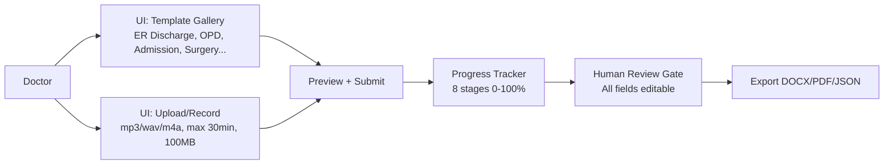

# MediBytes — Clinical Voice-to-Template System
## Product Definition (IDEA) | Target: 99% Production Accuracy

> **One-liner:** Record clinical voice (EN/HI/TA + Hinglish/Tanglish) -> auto-clean -> transcribe -> extract clinical entities -> validate at 99% -> **MANDATORY human verify (all fields editable)** -> auto-fill ER/OPD templates -> export DOCX/PDF — deployable to 1000 machines (cloud or air-gapped local).

> **Companions:** `PRODUCTION_PLAN_L7.md` (L7 build plan, SLOs, diagrams) | `ARCHITECTURE.md` (cloud vs local tool bake-off) | `EDGE_CASES.md` (24+ failures + fixes)

---

## 1. Vision & Core Values

1.  **Accuracy > Speed — 99% is non-negotiable.** Every entity is validated (confidence + ontology + dose-range) and **human-verified**. No auto-export.
2.  **Clinician Zero-Typing — 2 clicks:** Select Template + Upload Audio -> Review editable fields -> Export. <60s human time.
3.  **Template-Aware Intelligence:** Extraction adapts to template. ER Discharge ≠ OPD ≠ Surgery Note (different required fields, different validation).
4.  **Auditable & Safe:** Every field shows confidence (GREEN/YELLOW/RED) + source transcript snippet + 3s audio clip. `original_ai_value` vs `human_corrected_value` logged.
5.  **Deploy Anywhere — Same Image:** One Docker image runs on 1 laptop or 1000 hospital PCs — `STT_PROVIDER` switches `Faster-Whisper` (local) vs `Deepgram` (cloud). PHI never leaves if air-gapped.
6.  **API-First:** Any HIS/EHR can `POST /v1/jobs` with audio + `template_id` -> poll -> verify -> export. OpenAPI 3.1 + webhooks.

---

## 2. User Flow (Steps 1-2)



**UI Spec:** `frontend/src/ui` — File picker with waveform + duration, searchable template cards (with `required` fields count), progress bar per stage, editable review gate (see §5b), DOCX/PDF preview before download. PWA offline (IndexedDB drafts).

---

## 3. System Pipeline — 8 Stages (Steps 3-7)

```
[Audio Upload] -> 1. Audio Enhance (FFmpeg 16k mono + DeepFilterNet/RNNoise + Silero VAD)
              -> 2. STT (Faster-Whisper large-v3-int8 local / Deepgram Nova-3 cloud + GCP Chirp for Tamil)
              -> 3. Normalize (Indic transliteration, number/unit UCUM)
              -> 4. NER Ensemble (BioClinical ModernBERT + MuRIL/HingMBERT + LLM JSON mapping)
              -> 5. Validation Gate (FerroTERM SNOMED/RxNorm/ICD-10 µs + dose-range 1000x check)
              -> 5b. HUMAN REVIEW GATE (MANDATORY, all fields editable)
              -> 6. Template Fill (docx.js)
              -> 7. Export (Gotenberg DOCX->PDF/A)
              -> 8. Audit (Postgres WORM + MinIO + OTEL)
```

Each stage is bulkheaded (separate worker pool + queue) so STT OOM cannot block validation.

---

## 4. Stage Details

### Stage 1: Audio Enhancement (Step 3)
- Resample `16kHz mono` via `FFmpeg`, `loudnorm -16 LUFS`, VAD gate (Silero ONNX, <10ms) — drop silence <0.6s before STT.
- Denoise/dereverb: `DeepFilterNet4` (GPU, SOTA) / `RNNoise` (CPU 1-2% fallback). Store `raw + enhanced` in MinIO.
- Optional `pyannote 3.1` diarization behind flag (2GB VRAM) for doctor/patient overlap.
- Metrics: `SNR improvement >15dB`, `PESQ >3.5`.

### Stage 2: STT (Step 3b)
- **Local default:** `Faster-Whisper large-v3-int8` (4-8x faster, 2.1GB VRAM, 2.7% WER, 99 langs, offline) — handles EN/HI/TA + Roman HI.
- **Cloud premium:** `Deepgram Nova-3 Medical` (3.44% WER, `language=multi` inc HI, Keyterm Prompting 100 drugs, sub-300ms) for EN/HI; `GCP Chirp 3` for `ta-IN` preview (Deepgram Medical is EN-only).
- Output: `{transcript, segments: [{text, start, end, language, confidence}], word_timestamps}`.
- Hallucination guard: `no_speech_threshold=0.6`, repetition filter, Silero pre-trim.

### Stage 3-4: Clinical Entity Extraction (Steps 4-5) — Template-Aware
- **Example ER Discharge fields:** `Chief Complaint, History, Vitals (BP/HR/SpO2), Diagnosis (ICD-10), Drugs {name, dose_mg, unit, frequency, duration, route}, Allergies, Follow-up`.
- **Ensemble:** `BioClinical ModernBERT-large` (EN 90.8% ChemProt, 8192 ctx) + `MuRIL-large` (Hinglish 84.2% F1) + `HingMBERT` (77.14 F1) + `Tamil MuRIL` (71.1) + `spaCy` pipeline.
- **Negation:** `CAN-BERT` (F1 0.777) not `NegEx` (0.492) — catches "no allergy to penicillin" correctly.
- **LLM mapping (JSON schema-constrained):** Cloud `GPT-4o/Claude`, Local `Llama 3.1 70B Q4` via `vLLM` — normalizes `500mg x 2/day x 5 days = 5000mg` and code-mix `bukhar == fever`.
- Output: `[{entity_text, normalized_value, unit, confidence, source_sentence, negated, language}]`.

### Stage 5: Validation — The 99% Gate (Step 6)
1. Confidence `<0.85` or `null` -> RED (blocks export).
2. Ontology `FerroTERM` `/$validate-code` — drug must be in RxNorm (47K), disease in SNOMED CT (600K) or ICD-10-CM (74K), else RED + Top-3 phonetic suggest.
3. Dose-range `mg vs mcg 1000x` check via `validation_rules.json` (Lexicomp) — typical `mcg` but `mg` transcribed -> `UNIT_FLIP_WARNING` RED checkbox.
4. Numerical consistency `duration * frequency * dose == total`.
5. Negation `negated==true` -> exclude from allergy, badge `NEGATED`.
6. Missing `required` -> `REQUIRED_MISSING` RED `______`.

### Stage 5b: MANDATORY Human Review & Edit Gate (NEW — Your Requirement)

> **Rule:** `POST /v1/export` returns `403` if `job.status != verified`. No bypass, even for GREEN 0.99.

- **Every field editable:** Click to edit text, flip unit `mg<->mcg` (1000x warning), dropdown for ICD-10 (FerroTERM `/$expand` search), add/remove drug rows.
- **Source grounding:** "Show Source" per field -> jumps to transcript sentence + plays 3s word-timestamp clip.
- **Confidence panel:** `GREEN (>0.95) [Accept All Green] / YELLOW (0.85-0.95) "Review Yellow Only" / RED (<0.85 + checks) blocks export until checkbox`.
- **Live re-validation:** On edit, re-run Stage 5 via `POST /v1/validate` debounced <100ms.
- **Anti-fatigue:** `HIGH_RISK` (insulin, chemo, `mcg`) requires second reviewer `reviewer_id_2`.
- **Audit:** `original_ai_value` vs `human_corrected_value` + `reviewer_id` + `timestamp` feeds `eval/harness.py` for 99% metrics.
- **Offline:** PWA caches queue, IndexedDB drafts, `bulk-sync` when online.

### Stage 6-7: Template Paste & Export (Steps 6-7)
- **Template engine:** JSON-defined `templates/er_discharge.json` (versioned, `id@version` PK) with `layout: er_discharge.docx.j2` -> `docx.js` (312KB pure JS, no Chromium) fills `{{diagnosis}}` with validated value + styling.
- **Export:** DOCX natively (no conversion). PDF via `Gotenberg` sidecar `POST /forms/libreoffice/convert` (Chromium+LibreOffice, PDF/A, embed `Noto Sans Devanagari/Tamil` to avoid `□`). Fallback `libreoffice --headless` if no Docker.
- **Outputs:** `docx_url`, `pdf_url` (presigned 1h, WORM 7y), `json_url` (FHIR resources for EHR). User edits in-browser before final export.

---

## 5. Multilingual: EN / HI / TA + Code-Mix (NEW)

**Reality:** "Patient ko fever hai, give paracetamol 500mg BID 3 din tak" — one sentence mixes 3 languages + scripts.

- **STT:** Auto LID per segment, `language=multi` (Deepgram) or large-v3 auto, keep mixed script (Roman + Devanagari/Tamil), `word_timestamps` per word.
- **NER:** `MuRIL` transliteration-pretrained handles `बुखार == bukhar == fever` as same; `HingMBERT` for Hinglish, `Tamil MuRIL` for Tanglish. LLM prompt: "Input may be HI/TA/EN mixed, extract per JSON, normalize to English for ontology, preserve original_text."
- **UI:** Input language `Auto/EN/HI/TA`, output template language `EN (default, hospital record) / HI / TA / Bilingual` (config).
- **Eval:** Gold 600 audios (200/200/200 + code-mixed), WER/F1 reported **per language** — each must pass `F1>0.98` critical.

---

## 6. Scalability: 1000 Machines (Step 8)

- **Fleet (1000 desktops):** 1000x `docker-compose.yml` (`api+2 workers+postgres+minio+redis+ferroterm+gotenberg`) + central replica (`mc mirror` + `pg replication`, no K8s). `docker save/load` via USB for air-gap.
- **Central (1000 concurrent jobs):** `EKS 1.32 + Karpenter` (78-85% binpack) or `AKS` (7% cheaper), `A10G 24GB` for STT+LLM co-host, `L4 $0.60/hr` for STT-only, `HPA on queue_depth`, `SPOT` for non-critical.
- **Abstraction:** Stateless API containers + `Redis BullMQ` (job queue) + `RabbitMQ` (transactional outbox for audit, fencing) + `MinIO/S3` + `Postgres`. Horizontal: 2min audio = ~10s STT on GPU, 1000 concurrent = 1000 jobs queued -> autoscale workers. See `PRODUCTION_PLAN_L7.md` §11 for cost `~$500/mo fleet` vs `~$44k/mo central`.

---

## 7. API Documentation (Step 9)

**OpenAPI 3.1 at `/api/docs` (Swagger) + `/api/openapi.json` + Postman collection.** Versioned `/v1`, `Idempotency-Key` header, `X-RateLimit` headers, `Sunset` for deprecations.

| Method | Endpoint | Description |
| :--- | :--- | :--- |
| `POST` | `/v1/jobs` | `multipart audio + template_id + language + consent` -> `202 {job_id}` |
| `GET` | `/v1/jobs/{id}` | Status + progress `{stage, percent, eta, fields}` |
| `GET` | `/v1/jobs/{id}/fields` | Extracted + validation `GREEN/YELLOW/RED` |
| `PATCH` | `/v1/jobs/{id}/fields` | Edit field (re-validates, audited) |
| `POST` | `/v1/jobs/{id}/verify` | Verify (requires `reviewer_id`, blocks if RED) |
| `POST` | `/v1/jobs/{id}/export?format=docx|pdf|json` | Export (403 if not verified) -> presigned URLs |
| `GET` | `/v1/templates` | List templates |
| `POST` | `/v1/webhooks` | Register `job.verified`, `job.exported` webhook (HMAC) |

Auth: `JWT` (user) or `X-API-Key` (HIS, per `hospital_id`), rate limit `20/min upload` per key (Redis sliding window + token bucket).

---

## 8. Edge Cases (Step 9b) — Pointer

24+ cases detailed in `EDGE_CASES.md` (standalone): silent audio, overlap, noise, mumble, accent, Hinglish, transliteration, negation, `mg vs mcg 1000x`, sound-alike `Celebrex/Celexa`, missing field, ambiguous duration, GPU OOM, PHI leak, offline, injection, font `□`, audit tamper, hallucination, ICD drift, consent, quantization, reviewer fatigue — each with **tool-tied resolution** and **UI/API response**.

---

## 9. Evaluation Metrics to Prove 99% (Step 10)

**Component:**
- Audio: `SNR improvement >15dB`, `PESQ >3.5`
- STT: `WER <5%` overall (`<3%` target), `Medical WER (drugs only) <2%`
- NER: `Precision/Recall/F1` per entity (strict span), `F1 >0.98` critical (drug, diagnosis), lenient vs strict

**End-to-end (SLOs):**
- **Field Accuracy** `correct_fields / total_fields >99%` on 500+ real recordings (stratified by template/accent/noise/lang)
- **Critical Error Rate** `wrong dose/diagnosis/allergy <0.1%` (0 tolerance, human gate enforces)
- **Human Review Rate** `<15%` flagged (fast) — flags ensure safety, not too many
- **Latency** `p95 <30s` for 2min audio

**Protocol:**
- **Gold dataset:** 600 audios (200 EN/HI/TA, each code-mixed) double-annotated by 2 clinicians, adjudicated, versioned `gold-v1.2` WORM.
- **Harness:** `eval/harness.py` runs in CI, blocks PR if `ΔF1 < -0.2%` or `field_accuracy <99%`, reports per-language.
- **Pilot:** 100 live cases, system vs senior doctor correction, measure `human_corrected_value` diff -> feeds back.

---

## 10. Non-Functional

- **HIPAA/GDPR:** AES-256 at rest (MinIO SSE), TLS 1.3 in transit, audio TTL 30d (or tmpfs if no consent), RLS per `hospital_id`, WORM 7y for exports, BAA for cloud, air-gapped local needs no BAA, no PHI in logs (OTEL redact + Sentry scrub).
- **i18n:** UI strings externalized, `en-IN` default, `hi-IN`/`ta-IN` toggle for review gate.
- **Offline:** PWA service worker, IndexedDB drafts, `bulk-sync` endpoint.

---

## 11. Roadmap

| Phase | Weeks | Goal |
| :--- | :--- | :--- |
| 0 | 1 | Scaffolding: `docker-compose.yml` + OpenAPI stub + gold collection |
| 1 | 2-3 | Core pipeline behind flags, shadow 0% prod |
| 2 | 4-5 | Validation + Human Gate, dogfood 10 doctors, canary 5% |
| 3 | 6-7 | HI/TA + Gotenberg + load 1000 jobs |
| 4 | 8 | Hardening: chaos, HIPAA, runbooks, on-call |
| 5 | 9-10 | GA: 5% -> 25% -> 50% -> 100% canary, air-gap `docker save` ship |

---

*This IDEA is the product promise. For how we keep it without breaking prod, see `PRODUCTION_PLAN_L7.md`. For why each tool, see `ARCHITECTURE.md`. For what can go wrong, see `EDGE_CASES.md`.*
