# MediBytes — Pipeline Architecture Detailed Report
> Source: `PRODUCTION_PLAN_L7.md` v1.0.0 (2026-09-14) | Target: 99% Field Accuracy, 99.9% Availability, 1 → 1000 machines
> Languages: en-IN, hi-IN, ta-IN + Hinglish/Tanglish code-mix | Core Invariant: **No DOCX/PDF exports until human verifies every field.**

> **How to read this doc:** Every section starts with a **Plain-English line** + a **Terms in this section** table. Technical names stay, but each is defined where you meet it. If you are non-technical, read only the **> Plain English** boxes + term tables + diagrams.

---

## Table of Contents
1. [Executive Summary](#1-executive-summary)
2. [End-to-End Pipeline Architecture](#2-end-to-end-pipeline-architecture)
3. [8-Stage Pipeline Overview](#3-8-stage-pipeline-overview)
4. [Voice & Audio Pipeline → STT (No DB Storage)](#4-voice--audio-pipeline--stt-no-db-storage)
5. [LLM Extraction / Clinical NER](#5-llm-extraction--clinical-ner)
6. [Template System](#6-template-system)
7. [Validation — The 99% Gate](#7-validation--the-99-gate)
8. [Human Review Gate (Mandatory)](#8-human-review-gate-mandatory)
9. [Evaluation Metrics Architecture — Whole Pipeline](#9-evaluation-metrics-architecture--whole-pipeline)
10. [Queuing, Caching, Rate Limiting, Resilience](#10-queuing-caching-rate-limiting-resilience)
11. [API Documentation](#11-api-documentation)
12. [Data, Storage & Versioning](#12-data-storage--versioning)
13. [Pipeline Open Questions & Risks](#13-pipeline-open-questions--risks)

---

## 1. Executive Summary

> **Plain English:** Doctors talk, system types the discharge note, checks drug dangers, human approves in ~1 minute, then gives Word + PDF.

### Terms in this section
| Term you will meet | What it means — what it does |
|------|------------------------------|
| **SLO (promise) / SLI (measure) / Error budget / Burn** | SLI = what we count (accuracy). SLO = promise (>99%). Budget = allowed mistakes (1% = 6 per 600). Burn = using budget too fast → freeze features. |
| **Field Accuracy** | % final boxes doctor didn't fix. `594/600 = 99%`. The promise we sell. |
| **Ensemble** | Mix of models, not one. No single AI reaches 99%. |
| **Docker image `medibytes:1.0.0`** | One sealed box with all code. Same box runs on cloud + hospital PC. |
| **Bulkhead** | Separate worker pools per step so one slow step can't sink others — like ship compartments. |
| **Shadow / Canary / Flag (Unleash)** | Flag = on/off switch no restart. Shadow = new model on 10% copy, invisible. Canary = 5% real → 25% → 50% → 100%, auto-back if bad. |
| **Blast radius = 1 document** | One bad audio hurts only itself. Via unique `job_id` + crash-proof outbox + locked audit. |
| **WORM audit** | Write Once Read Many — log can't be edited. Legal proof. |

**Problem:** Doctors spend 40% time typing ER Discharge/OPD notes. Ward audio is noisy, drug dose errors (mg vs mcg = 1000x) are fatal, and Hinglish/Tanglish code-mix breaks naive AI.

**L7 answer — 99% = AI + Dictionary + Human Gate:**
1. **Accuracy is a promise (SLO)**, not a dashboard. Code release blocked if Field Accuracy < 99%.
2. **No single AI is 99%.** Mix: confident AI (>0.95) + medical dictionary check + MANDATORY editable human review. Never auto-exports.
3. **One box, two places.** Same Docker image `medibytes:1.0.0` runs on internet cloud and no-internet hospital PC. Switched by `STT_PROVIDER`, `VALIDATOR`.
4. **Separate workers per step.** STT crash can't block printing.
5. **Switch first, ship second.** Test on copy (Shadow 10%) → 5% real users → 100%.
6. **One bad audio hurts only itself.** Unique `job_id` + crash-proof outbox + unchangeable audit.

---

## 2. End-to-End Pipeline Architecture

> **Plain English:** Doctor/HIS → front door → to-do lists → 5 workers → dictionary checker → human screen → Word/PDF maker. Everything watched.

### Terms in this section
| Term | What it means |
|------|---------------|
| **PWA (Browser PWA)** | Web app that works offline, installable like an app. |
| **HIS / EHR** | Hospital computer system that stores patient records. Talks to us via API. |
| **CDN (CloudFront / Nginx) + TLS** | Fast worldwide file server + encryption in travel. Serves web pages quickly. |
| **API Gateway (FastAPI + Uvicorn + Pydantic + OpenAPI)** | Front door. Checks login, limits speed, checks inputs, auto-makes docs. Python because AI libraries are Python-first. |
| **JWT / API Key** | JWT = doctor login token. API Key = hospital system password (`hospital_id` scoped). |
| **Worker** | Background computer doing one stage so uploads never wait. |
| **BullMQ (Redis) + RabbitMQ + Outbox** | BullMQ = fast to-do list (retries, ER-first priority, UI board). RabbitMQ + Postgres outbox table + relay = crash-proof list, no record lost even on power cut. |
| **Postgres 16** | Main list database: jobs, forms, logs. |
| **MinIO / S3 + WORM** | File boxes for voice/Word/PDF. WORM = locked, can't edit/delete (raw 30d, finals 7y). |
| **FerroTERM + SNOMED / RxNorm / ICD-10 + FHIR** | FerroTERM = tiny Rust dictionary checker (microseconds). RxNorm = 47K drugs, SNOMED = 600K diseases, ICD-10 = 74K billing codes. FHIR = hospital data standard. |
| **Next.js Review UI** | Must-approve screen. No approve = no print. |
| **OTEL / Prometheus / Grafana / Sentry** | OTEL = job tracker across 8 steps. Prometheus = counters. Grafana = charts. Sentry = crash reporter (patient words scrubbed). |

### 2.1 High-Level (C4 L1)

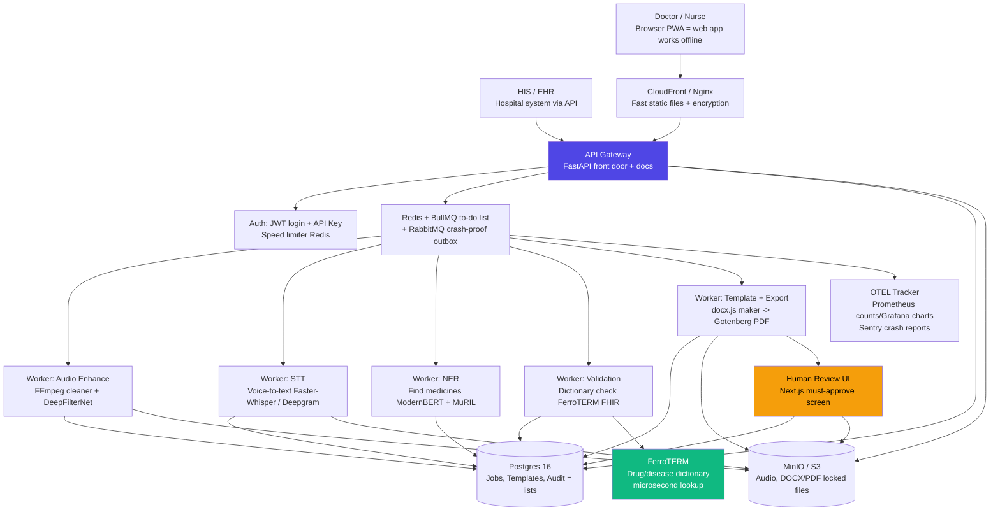

### 2.2 End-to-End Sequence

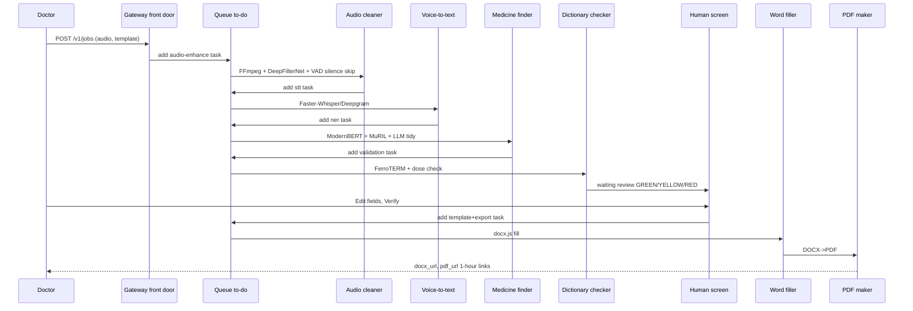

### 2.3 Deployment — Same Image, Two Planes

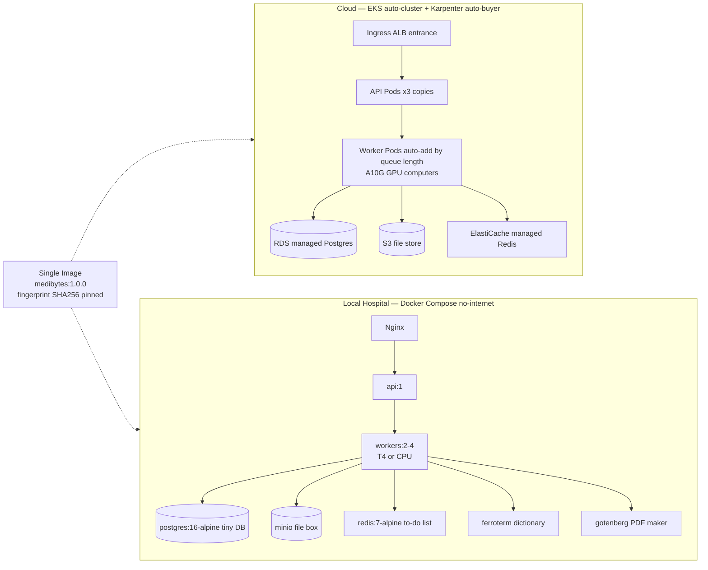

> Fleet (1000 PCs) = 1000x local boxes + nightly copy to center via `mc mirror` + DB copy. Big cloud cluster only if >5 servers in one building.

---

## 3. 8-Stage Pipeline Overview

> **Plain English:** Like a factory line: receive → clean sound → write words → fix languages → find medicines → safety check → doctor approves → fill form → print + lock proof.

### Terms in this section
| Term | What it means |
|------|---------------|
| **Ingest** | Receive + quick check at front door. |
| **STT** | Speech-to-Text — voice → written text. |
| **Normalization** | Fix `bukhar/बुखार/fever` + `500 मिलीग्राम` → standard English + units. |
| **NER** | Named Entity Recognition — find drugs/diseases/vitals/allergies. |
| **Validation GREEN/YELLOW/RED** | GREEN ok, YELLOW glance, RED blocks print. |
| **Human gate 403** | Error 403 = print refused until doctor presses Verify. |
| **Template filling (Jinja2)** | Fill `{{boxes}}` into Word design. |
| **Export PDF/A + FHIR JSON + presigned 1h** | PDF/A = long-life PDF. FHIR JSON = hospital-system format. Presigned = 1-hour download link. |
| **Audit + OTEL trace** | Unchangeable log + time trail across 8 steps. |
| **p95 + SLO <30s** | p95 = 95% faster than this. Promise: machine work <30s for 2-min audio. |

| Stage | Name (plain) | Where | Time (2-min audio) | Input → Output |
|-------|------|-------|----------------------|----------------|
| 0 | Receive & quick check | Front door | <0.1s | `voice file + form choice + language + store? yes/no` → `ticket {job_id, queued}` |
| 1 | Clean sound | Worker | 1-3s | `mp3 ≤100MB, ≤30min` → `clean 16kHz wav + clarity scores` |
| 2 | Voice → text (STT) | Worker needs GPU | 5-12s | `clean wav` → `written text + per-word times` |
| 3 | Fix languages/units | Worker | <0.2s | `bukhar/बुखार/fever mix` → `standard English + mg/mcg codes + language tags` |
| 4 | Find medicines (NER+LLM) | Worker | 1-2s | `text + form shape` → `drug/disease list + confidence + proof sentence` |
| 5 | Safety check | Worker | <0.3s | `found list` → `GREEN ok / YELLOW check / RED blocked per box` |
| 5b | **Doctor approves** | Screen + API | 30-60s human | `waiting review` → `verified` (no approve = no print, error 403) |
| 6 | Fill Word form | Worker | <0.5s | `approved boxes + Word layout` → `DOCX` |
| 7 | Make PDF | Worker | 1-4s | `DOCX` → `DOCX + PDF + hospital JSON (1-hour links)` |
| 8 | Lock proof | Background | <0.1s | `all steps` → `unchangeable log + locked files + time trail` |

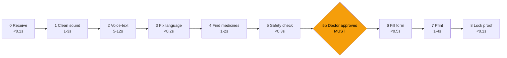

**Promise (SLO):** 95% of 2-min audios finish `receive → approved` in <30s machine time. If slower 5 min → use smaller faster model or add workers, skip speaker-split.

---

## 4. Voice & Audio Pipeline → STT (No DB Storage)

> **Plain English:** Voice files never go inside the database. Database keeps only the file address + written text. Voice lives in file box or temporary RAM.

### Terms in this section — voice storage
| Term | What it means — what it does |
|------|---------------|
| **Postgres TEXT pointer vs BYTEA blob** | We store only address text (`audio_raw_s3 TEXT`), never sound bytes (`BYTEA`). So voice can't leak via DB backup. |
| **MinIO / S3 + SSE-S3 + Object Lock 30d** | File box. SSE-S3 = auto-encryption. Object Lock = can't delete 30 days. |
| **tmpfs `/tmp:size=1g` encrypted** | RAM-only temp folder. Used when store=no. Auto-wiped after text made. Never disk/DB. |
| **PHI / HIPAA** | PHI = patient health info. HIPAA = hospital privacy law. Less stored = safer. |

> ### 🔒 CONSTRAINT: Voice never stored in any database
> - **Postgres keeps only pointers** (`audio_raw_s3 TEXT`, `audio_enhanced_s3 TEXT`) + `transcript_json` (written text). No `BYTEA` sound blobs.
> - **Sound bytes only in:** MinIO/S3 file box (if patient said store=yes) or encrypted RAM folder `tmpfs /tmp:size=1g` (if store=no, wiped right after text made).
> - Why: less patient data stored = HIPAA happy + air-gap safe.

### 4.1 Consent-Based Storage Decision

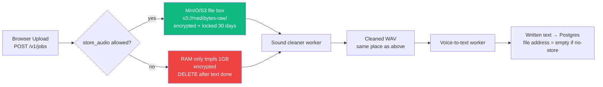

| Patient choice | DB `audio_raw_s3` | Raw sound | Cleaned sound | Written text |
|---------|----------------------------|-----------|----------------|------------|
| `store=yes` | `s3://medibytes-raw/{job_id}.mp3` | File box locked 30d | File box | Text in DB ✅ |
| `store=no` | `empty` | RAM only, deleted after STT | RAM only | Text in DB ✅ |

### 4.2 Stage 0: Receive & Quick Check (<0.1s)

### Terms in this section — Stage 0
| Term | What it means |
|------|---------------|
| **ffprobe + magic bytes** | Reads real audio bytes, not file name, to reject fake files. |
| **ClamAV sidecar** | Virus scanner next to front door (local mode). |
| **413** | Error = file too big (>100MB or >30min). |
| **Idempotency-Key + SETNX EX 24h** | Unique ID per click. Double-click returns same ticket. Kept 24h in Redis. |
| **LID + `priority` + BullMQ Flow / FlowProducer** | LID = detect language per sentence. Priority ER=1 jumps queue (routine 5). Flow = auto-chain enhance→stt→ner→check. |

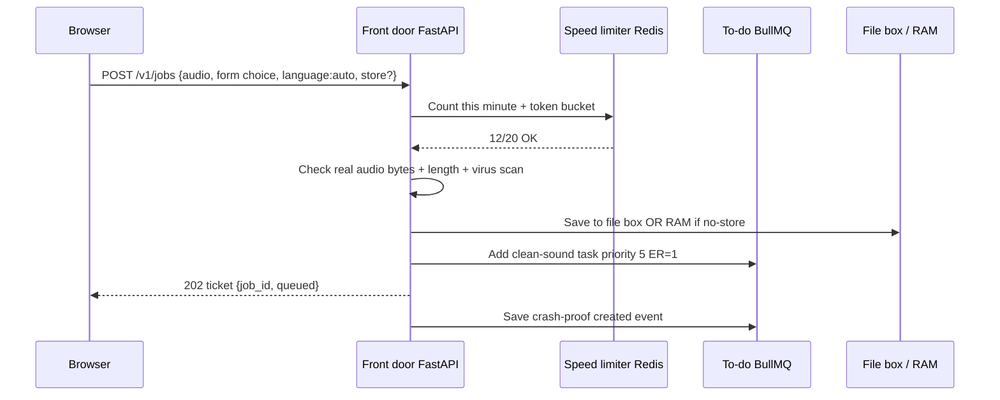

Rules in plain English:
- Reject `>100MB` or `>30min` with `413 too big`. Check real bytes via `ffprobe`, not just file name.
- No duplicates: `Idempotency-Key` unique ID → same ticket returned if user double-clicks. Kept 24h.
- Language hint `auto` = detect per sentence. ER tickets jump queue (`priority=1` vs `5`).

### 4.3 Stage 1: Clean Sound (1-3s)

### Terms in this section — Stage 1
| Term | What it means |
|------|---------------|
| **FFmpeg + loudnorm I=-16** | Converts any audio to 16kHz single-channel + fixes volume in <10ms. |
| **Silero VAD ONNX 5ms, speech_prob ≥0.5** | Keeps only speaking parts, skips silence/fan. If >95% silent or <0.6s → stop 422 NO_AUDIO, saves GPU 4-8x. |
| **DeepFilterNet4 (Rust+ONNX 30MB)** | Best noise+echo remover. Needs GPU. |
| **RNNoise (Xiph BSD 1-2% CPU)** | Light cleaner for cheap CPU / no-internet. Fallback if GPU crashes (OOM). |
| **AGC far-field + SNR + VAD ratio** | AGC = auto mic gain for far doctor. SNR = clarity score (higher cleaner). VAD ratio = % speaking. Saved as `enhancement_meta`. |
| **Diarization pyannote 3.1 (2GB VRAM)** | Splits DOCTOR vs PATIENT voices. OFF normal — costs GPU. Flag `flag.diarization`. |
| **OOM** | Out of Memory crash. Fix: retry light RNNoise. |

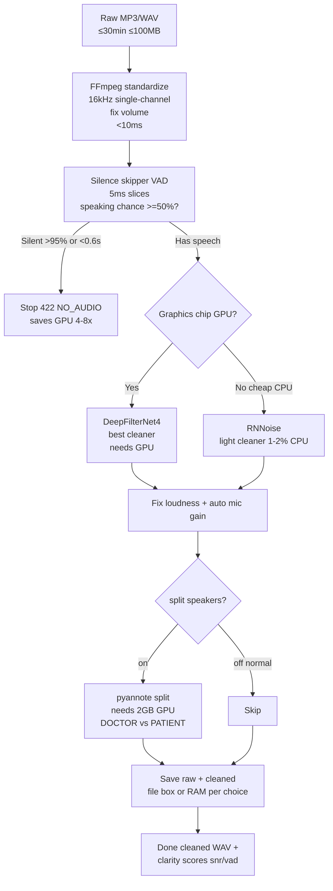

- Keep both raw + cleaned as proof (if store=yes). Crash on big GPU → retry light mode.

### 4.4 Stage 2: Voice → Text (5-12s, needs GPU)

### Terms in this section — Stage 2
| Term | What it means |
|------|---------------|
| **Faster-Whisper large-v3-int8 (CTranslate2)** | Offline voice reader. Same 2.7% error as big Whisper, 4-8x faster, needs 2.1GB GPU (vs 5GB). 13.9 jobs/s. Default local + cloud backup. |
| **Deepgram nova-3-medical / multi + GCP chirp-3 + whisper.cpp** | Deepgram medical = internet English best (<3s). `multi` includes Hindi. Chirp-3 = Tamil preview ($0.016/min). whisper.cpp = Apple Mac edge free. Never use Deepgram-medical for Tamil (English-only). |
| **VRAM (A10G / L4 / T4) + `FLAG_stt_provider`** | VRAM = GPU memory. Flag picks reader per hospital/language without restart. |
| **beam_size=5, no_speech_threshold, compression_ratio** | Try 5 guesses (+2% correct), ignore silence, block invented repeats. |
| **word_timestamps** | Each word keeps start/end time → click-word plays 3-sec clip. |
| **Keyterm prompting (100 drugs)** | Send drug list with request → 40% fewer missed drugs (`paracetamol` not `pair of seat`). |
| **Hallucination guard + WER 2.7%** | Blocks `thank you thank you…` on silence via trim + repeat filter + confidence check. WER = % words wrong. |

| Voice reader | When we use it | Languages | Cost | 2-min time |
|----------|------|-----------|------|---------------|
| `faster-whisper:large-v3-int8` | **Normal + no-internet**, private | 99 incl. en/hi/ta | $0.0048/hour on L4 GPU | 5-8s GPU, 12s CPU |
| `deepgram:nova-3-medical` | Internet English/Hindi best | English medical, `multi` incl. Hindi | $0.0043/min | <3s live |
| `gcp:chirp-3` | Internet Tamil only | 125, Tamil preview | $0.016/min | 4s |
| `whisper.cpp` | Apple Mac edge | Same as Whisper | Free | 10x realtime Metal chip |

Plain English why first row wins offline: same 2.7% word error, 4-8x faster, needs only 2.1GB GPU vs 5GB.

```python
# Accuracy settings — try 5 guesses, keep word times
beam_size = 5                    # +2% correct, still <30s promise
no_speech_threshold = 0.6        # ignore silence
compression_ratio_threshold = 2.4  # block invented repeats
word_timestamps = True           # needed so click-word plays audio
```

- **Drug hint list:** send 100 drug names each time → 40% fewer missed drugs.
- Tamil → never use Deepgram Medical (English-only). Switch per hospital/language via flag.
- Anti-invention: block `thank you thank you thank you`, trim silence first, check confidence.
- Output: `{full text, sentences with start/end/language/confidence, per-word times, detected language}` → DB text field.

### 4.5 Stage 3: Fix Languages/Units (<0.2s)

### Terms in this section — Stage 3
| Term | What it means |
|------|---------------|
| **LID per segment** | Detect `hi-IN 0.8 / en 0.2` per sentence for Hinglish `Patient ko fever hai…`. |
| **Transliteration (IndicXlit / MuRIL)** | `bukhar = बुखार = fever` → same meaning whatever script. |
| **UCUM (mg/mcg/ml/U)** | Standard unit codes. `500 मिलीग्राम` → `500 mg`. Needed for safe dose math. |
| **Code-mix tag en|hi|ta|mix + SNOMED lookup** | Tag each sentence, then look up clean English (`fever → SNOMED 386661006`) for dictionary. Screen shows original + English (HI/TA toggle). |

> **Plain English:** `Patient ko fever hai, give paracetamol 500mg BID 3 din tak` → clean English + standard units for dictionary.

```
Hinglish audio
 -> detect [Hindi 80%, English 20%]
 -> raw text keeps mix
 -> transliterate bukhar/बुखार/fever → same
 -> numbers: 500mg / 500 मिलीग्राम → 500 mg + code mg/mcg/ml/U
 -> tag each sentence en|hi|ta|mix
 -> look up fever → SNOMED 386661006
 -> screen shows original + English result (switch HI/TA)
```

---

## 5. LLM Extraction / Clinical NER

> **Plain English:** Three specialist readers + one tidy writer find drugs/diseases/vitals/allergies and return neat boxes with proof sentence + confidence.

### Terms in this section
| Term | What it means |
|------|---------------|
| **NER (find medicines)** | Finds drugs/diseases/vitals/allergies/history in text. |
| **ModernBERT-large BioClinical (8192 ctx, 90.8% ChemProt)** | English medical reader. Long-note memory. Good at `paracetamol 500mg BID`. |
| **MuRIL-large (Hinglish 84.2% vs XLM-R 79.2%, Tamil PANX 71.1)** | Google India mix reader. Understands transliterated `bukhar`. |
| **HingMBERT (+3.6pp over mBERT)** | Hindi-English mix specialist. |
| **spaCy tokenizer + sectionizer** | Splits text into words/sentences/sections before heads read. |
| **Negation CAN-BERT (F1 0.777) + ConText fallback** | Understands `no allergy = NOT allergy`. Rule-alone 0.492 unsafe → transformer required. Critical. |
| **LLM Mapping GPT-4o/Claude (cloud) vs Llama 70B/Qwen (local vLLM/Ollama Q4_K_M 24GB A10G)** | Big writer → strict hospital JSON. Cloud smarter (-31% missed with examples). Local private, needs big GPU. |
| **JSON-schema constrained + FHIR + UCUM/ICD-10** | Forces only valid fields (no prose) in hospital standard, doses standard, diseases coded. Keeps `original_text` + `source_sentence` proof. |

### 5.1 Ensemble (Not Single Model)

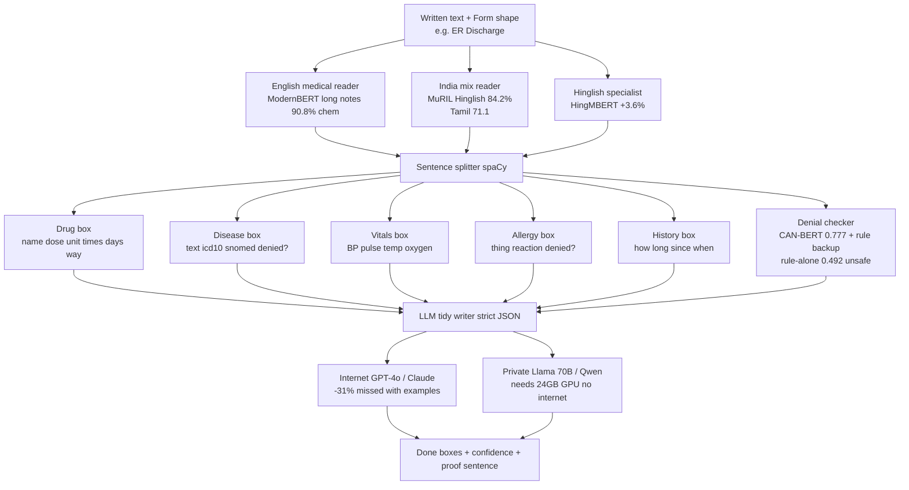

Instruction to LLM: *“Input may mix Hindi/Tamil/English. Fill hospital JSON. Doses to standard units, diseases to ICD-10. Output English for dictionary but keep original words.”*

### 5.2 Form-Aware Filtering
- ER Discharge looks for Complaint + Diagnosis + Drugs + Allergies + Follow-up.
- Surgery Note looks for Operation + Sleep-drug (anesthesia) + Implants.
- Form JSON tells NER which boxes are required.

### 5.3 Confidence → Color

```
score = best word confidence × dictionary hit × writer confidence
GREEN  >0.95  → looks good, bulk-approve allowed
YELLOW 0.85-0.95 → human must glance
RED    <0.85 or empty → blocks print until fixed
```

---

## 6. Template System

> **Plain English:** Template = empty hospital form + Word design. We fill boxes, keep logo/styles, remember version so old records never change shape.

### Terms in this section
| Term | What it means |
|------|---------------|
| **Template JSON (`er_discharge.json`) + `coded/text/table/date`** | Form shape. `coded` = must be real ICD-10/SNOMED code. `table` = repeat drug rows. `date` = ISO date. |
| **Layout `.docx.j2` (Jinja2)** | Word design with `{{chief_complaint}}` placeholders. |
| **Postgres PK (id,version) never mutated** | Old versions never edited, only new added. Ticket pins `er_discharge:2.1.0` so old record never changes shape. |
| **docx.js 312KB (primary) vs python-docx (fallback)** | docx.js = pure JS, no browser, serverless+local. python-docx = Python backup when no Node. |
| **s3://medibytes-templates/ + Redis PubSub invalidate + preview** | Designs in file box. Publish → broadcast `forget old template:id`. Preview with dummy patient via `POST /preview`. |

### 6.1 Definition (`templates/er_discharge.json`)

```json
{
  "id": "er_discharge_v2",
  "version": "2.1.0",
  "fields": [
    {"key": "chief_complaint", "type": "text", "required": true, "source_entities": ["symptom"]},
    {"key": "drugs", "type": "table", "columns": ["name","dose","unit","frequency","duration"], "source_entities": ["drug"]},
    {"key": "diagnosis", "type": "coded", "system": "http://hl7.org/fhir/sid/icd-10", "required": true}
  ],
  "layout": "er_discharge.docx.j2"
}
```

| Box type | Means | Check |
|------------|---------|------------|
| `text` | Free writing | must-fill + length |
| `coded` | Must be real dictionary code | FerroTERM check |
| `table` | Repeat rows (drug list) | each row checked, min/max rows |
| `date` | Calendar date ISO | real date range |

### 6.2 Versioning & Printing

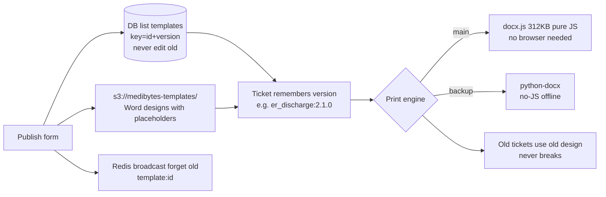

- Preview: `POST /v1/templates/{id}/preview` with dummy patient.
- Fill `{{chief_complaint}}` → real value, keep fonts/headers/logo.

---

## 7. Validation — The 99% Gate

> **Plain English:** Never trust AI alone. Every box checked: sure? real drug? safe dose? mg/mcg not flipped? math adds up? not denied? not empty?

### Terms in this section
| Term | What it means |
|------|---------------|
| **FerroTERM `$validate-code / $expand` (µs)** | Tiny Rust dictionary checker. Asks `real code? / list group?`. |
| **RxNorm 47K / SNOMED 600K / ICD-10 74K** | Drug list / disease dictionary / billing codes. Miss → RED + 3 sound-alike fixes via Double Metaphone (`parcetamol → paracetamol`). |
| **Lexicomp/FDB + `validation_rules.json` (Redis cached)** | Drug rule books: max daily dose. Powers `DOSE_EXCEEDED` + `UNIT_FLIP_WARNING 1000x` (e.g. thyroid mcg read as mg). Blocks print. |
| **Numerical consistency + Negation (CAN-BERT+ConText) + Schema required** | Math `500mg×2×5d=5000mg` mismatch → YELLOW. `no` → tag DENIED skip. Empty must-fill → RED MISSING. Output `validation_json` per box. |

### 7.1 Flow (<0.3s, cheap CPU)

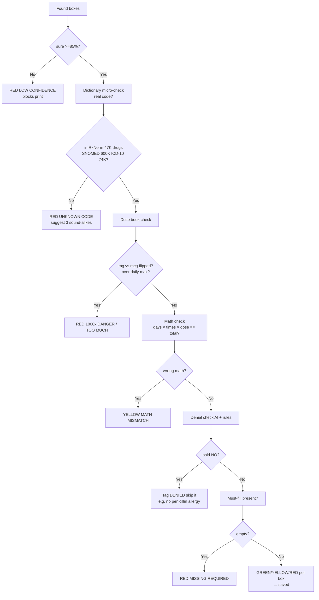

### 7.2 Rules Table (plain)

| Check | What it asks | If bad | Doctor example |
|------|-------|--------|---------|
| Sure? | AI sure ≥85%? | RED blocks | unclear audio |
| Real code? | In drug/disease book? | RED + suggestions | typed `parcetamol` |
| Safe dose? | Under daily max? | RED TOO MUCH | paracetamol >4000mg/day |
| Unit flipped? | Usual `mcg` but got `mg`? | RED 1000x WARNING | thyroid 100mg → should be mcg? |
| Math ok? | `500mg x 2/day x 5d = 5000mg`? | YELLOW | spoken total differs |
| Denied? | Said `no`? | Tag DENIED, don't list as allergy | `no penicillin allergy` |
| Must-fill? | Required box filled? | RED MISSING | no diagnosis code |

```python
# Safety book (validation_rules.json, cached in Redis)
if unit == "mg" and drug == "paracetamol" and dose > 4000:
    flag = "DOSE_EXCEEDED — too much per day?"
if usual_unit[drug] == "mcg" and unit == "mg":
    flag = "UNIT_FLIP_WARNING 1000x — confirm mcg?"
```

Output saved: `[{box, color, checks passed, message, fix hint}]`.

---

## 8. Human Review Gate (Mandatory)

> **Plain English:** Doctor sees sound + text + boxes side-by-side, fixes with clicks, then presses Verify. No verify = no Word/PDF (error 403), even if all green.

### Terms in this section
| Term | What it means |
|------|---------------|
| **403 if `status != verified`** | HTTP refused — print door locked until Verify, even all-GREEN. No bypass. |
| **Waveform + word_timestamps + highlights** | Click word → hear 3 sec. Drug blue, disease red. `Show Source` jumps to sentence. |
| **FerroTERM `/$expand` dropdown + dose widget + `POST /v1/validate` debounced** | Pick ICD-10 code from search, calc dose, each typing re-checks <0.1s (waits for pause). |
| **`reviewer_id` + `reviewer_id_2` HIGH_RISK + `original_ai vs human_corrected`** | Who approved + second doctor for insulin/chemo/mcg + what AI said vs fixed + when → teaches evaluation. `Accept All Green` still counts verified. |
| **PWA service worker + IndexedDB + `POST /v1/bulk-sync`** | Offline web app: drafts on device, syncs when internet returns. |

```
┌─────────────────────────────────────────────────────────────────┐
│ Left: Sound + Text together                                    │
│  Sound wave — click word → hear 3 sec                           │
│  Colors: Drug=blue, Disease=red                                 │
├─────────────────────────────────────────────────────────────────┤
│ Middle: Form — EVERY BOX CAN BE TYPED                           │
│  [Drug 1] Name [paracetamol ▼] Dose [500] Unit [mg ▼] [⚠️ mcg?]│
│           Times [twice daily ▼] Days [5]                        │
│           Sure: GREEN 0.97 | Heard: paracetamol 500mg            │
│  [+ Add Drug] [Remove]  Empty RED shows ______                   │
├─────────────────────────────────────────────────────────────────┤
│ Right: Sure panel                                              │
│  ● GREEN 12 — [Approve all green]                               │
│  ● YELLOW 2 — Show yellow only                                  │
│  ● RED 1 — 1000x warning blocks print ☑ I confirm               │
│  [Save draft] [Verify & Print] off if RED                       │
└─────────────────────────────────────────────────────────────────┘
```

Plain behaviors:
- Type or pick ICD-10 from search + dose calculator.
- Each edit re-checks in <0.1s.
- Risky drugs (insulin, cancer, `mcg`) need second doctor ID.
- Saves `AI said vs doctor fixed + who + when` → teaches next evaluation.
- Works offline, syncs later.

API in plain:
```
GET  /v1/jobs/{id}/review  -> get boxes + checks + text + sound link
PATCH /v1/jobs/{id}/fields -> fix one box, re-check, logged
POST /v1/jobs/{id}/verify  -> approve if no RED {doctor_id}
```

---

## 9. Evaluation Metrics Architecture — Whole Pipeline

> **Plain English:** How we prove 99% is real. We keep 600 perfect examples checked by 2 doctors, run the factory on them every code change, score each step + final, block release if score drops. Live patients also sampled.

### Terms in this section — evaluation
| Term | What it means |
|------|---------------|
| **Gold set 600 (200/lang, WORM v1.2 quarterly)** | Perfect answers by 2 doctors: clean+noisy, accents, all forms. Locked versioned, refreshed 3 months. |
| **`eval/harness.py` + pinned versions** | Runner uses same AI/dictionary/form versions so scores comparable. |
| **WER / Medical WER / NER F1 strict / Field Accuracy / Critical Error / ΔF1** | WER = % words wrong (<3%). Medical WER = drug words wrong (<2%). F1 = boxes exactly right, missed+extra balanced (>98% EACH lang, not average). Field Accuracy = boxes not fixed (>99%). Critical = dangerous GREEN slips (<0.1% = 1/1000). ΔF1 = worse than last week? (>-0.2%). See 9.3 table for doctor examples. |
| **p95 / Availability 99.9% (43m/mo) / Review & Correction Rate** | p95 = 95% faster than X (<30s machine). Availability = uptime. Review rate = % flagged YELLOW+RED (<15%, tired if >20%). Correction = % doctor changed live (must >99% right in 100 pilot to launch). |
| **CI (10 gold fast) → Full 600 → Shadow 10% → Canary 5→100% → Live sample** | Fast check per PR, full nightly, copy-test invisible, grow real users auto-back if error>1% 5m, then compare AI vs fix + burn chart. Fail = block merge + freeze + rollback flag. |
| **Grafana / PagerDuty / Testcontainers / schemathesis / Pact / k6** | Grafana = charts (p50/p95/p99, WER/lang, queue/GPU, color split). PagerDuty = pages on-call. Testcontainers = throwaway DBs per test. schemathesis = API attacker. Pact = HIS contract. k6 = 1000 fake users + kill GPU + cut net + printer race. |

### 9.1 Big Picture

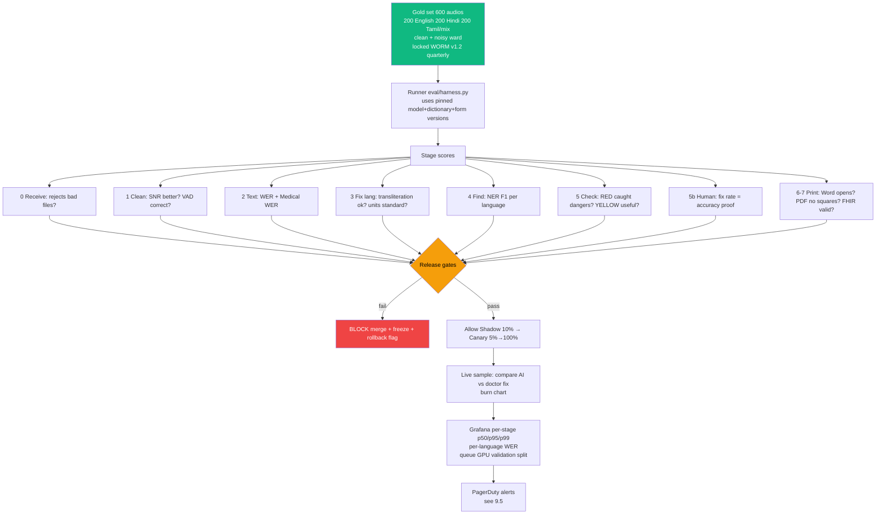

### 9.2 Runner (`eval/harness.py`) — What CI Actually Runs

```python
gold = load_gold("s3://medibytes-gold/v1.2")  # 600 audios, 2 doctors agreed
results = run_pipeline(gold.audios)  # same model_version + terminology_version + template_version
metrics = {
  "wer": wer(results.transcripts, gold.transcripts),            # plain: % words wrong
  "medical_wer": wer_on_drugs_only(...),                        # plain: % drug words wrong
  "ner_f1": f1(results.entities, gold.entities, strict=True),  # plain: % boxes exactly right
  "field_accuracy": correct_fields / total_fields,              # plain: % final boxes right
  "critical_error_rate": wrong_dose_or_diagnosis / total_fields # plain: % dangerous mistakes slipped
}
assert metrics["field_accuracy"] >= 0.99, "BLOCKED: accuracy dropped"
assert metrics["critical_error_rate"] < 0.001, "BLOCKED: safety"
for lang in ["en-IN","hi-IN","ta-IN","mix"]:
    assert metrics_by_lang[lang]["ner_f1"] > 0.98, f"BLOCKED: {lang}"
```

### 9.3 Every Metric in Layman Terms

| Metric (code name) | Plain meaning + doctor example | Target | Why it matters | If fails |
|--------|-----------|--------|-------------|----------|
| **WER — Word Error Rate** | % words typed wrong. `100 words, 3 wrong = 3%`. | <3% | Typing baseline. | Block merge, check STT model/noise. |
| **Medical WER (drug-only)** | % drug/dose words wrong. `paracetamol 500mg → paracetamol 50mg = wrong`. | <2% | Drug typo kills. Stricter than normal WER. | Block, add drug hints, switch provider. |
| **NER F1 (strict)** | % boxes exactly right (name+dose+unit must all match). Balances missed vs extra boxes. | >98% per language, critical >0.98 | Finding step core. Must pass English AND Hindi AND Tamil AND mix separately, not just average. | Block that language, retrain MuRIL/HingMBERT. |
| **Field Accuracy** | % final boxes doctor didn't need to fix. `600 boxes, 594 right = 99%`. | >99% | The promise we sell. | Block merge, freeze features, rollback model flag. |
| **Critical Error Rate** | % dangerous slips past checker (wrong drug/dose/diagnosis/allergy marked GREEN). `1 per 1000 = 0.1%`. | <0.1% | Safety. One slip can harm. | Immediate canary rollback + force re-review all recent. Page on-call. |
| **ΔF1 regression** | Did we get worse than last week? Drop >0.2% = regression. | >-0.2% | Catches silent worsening. | Block PR. |
| **Latency p95 e2e** | 95% of 2-min audios finish machine work in X sec (human approve time excluded from machine SLO, tracked separately). | <30s | Ward can't wait. | Use smaller model `distil-large-v3`, add GPU workers, skip speaker-split. |
| **Availability 99.9%** | Working 99.9% of month = down max 43 min/month. Checked via `/health` + job poll + worker heartbeat. | 99.9% | Hospital 24/7. | Page, autoscale, circuit breaker. |
| **Human Review Rate** | % boxes flagged YELLOW+RED. `15 of 100 = 15%`. | <15% flagged | If too many flags, doctors get tired and ignore. | Alert (don't rollback), tune thresholds. If >20% for 1h → alert. |
| **Correction Rate (live)** | % AI boxes doctor changed live. Inverse of accuracy. Pilot must show >99% correct to go-live. | >99% correct in 100 live cases | Real-world proof, not just lab gold. | Don't go GA, fix + re-pilot. |
| **Queue depth / GPU VRAM / Stage p95** | How many waiting? GPU full? Which step slow? `stt queue 42, p95 7.2s`. | depth <1000, OOM <3/hour | Early warning before SLO burns. | Scale workers, breaker to small model. |

Worked example: `600 gold boxes → 6 allowed wrong for 99%. 1 allowed dangerous per 1000. Tamil must also be ≥98% alone — can't hide Tamil 90% behind English 99%.`

### 9.4 Per-Stage Checks (so you know where it broke)

| Stage | What we score | How | Pass line | Layman |
|-------|---------------|-----|-----------|--------|
| 0 Receive | Rejects bad files, no duplicates | Feed corrupt/oversize/double-click | 100% correct reject + same ticket | Door guard works? |
| 1 Clean | Sound clearer? Silence skipped right? | SNR before/after, VAD vs human labels, OOM rate | SNR up, VAD >95%, no crash | Cleaner helps, not hurts? |
| 2 Text | Words right? Drugs right? Times aligned? | WER, Medical WER, word-time overlap | WER <3%, med <2% | Typist good? |
| 3 Fix lang | `bukhar` = fever? Units standard? | Transliteration match, UCUM convert rate | >98% | Translator good? |
| 4 Find | Boxes exactly right per language | Strict F1 en/hi/ta/mix | >98% each | Finder good in all languages? |
| 5 Check | Dangers caught? Flags useful? | RED recall on injected mg/mcg errors, YELLOW precision | 100% critical caught, false RED low | Guard dog barks at thief, not guests? |
| 5b Human | How much doctor fixed? Time? | `human_fixed / total`, seconds to verify | Fix rate = 1-accuracy, time 30-60s | Doctors trust it? |
| 6-7 Print | Word opens? PDF readable Tamil/Hindi (no □)? Hospital JSON valid? | Open in LibreOffice, font glyph check, FHIR `$validate` | 100% open, 0 tofu boxes | Printer works? |
| 8 Lock | Log complete? Files locked? Trail linked? | Audit row count = jobs, WORM lock check, trace_id spans 8/8 | 100% | Proof locked? |

### 9.5 Gates, Dashboards, Alerts (neat flow)

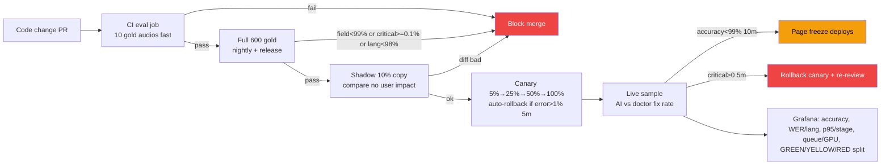

| Alert | When | Plain action |
|-------|------|--------------|
| Accuracy burn | `field_accuracy <0.99` 10m | Page, freeze new features |
| Critical slip | `critical_errors >0` 5m | Page, rollback new model, force re-check recent |
| Queue jam | `depth >1000` 5m | Add workers, skip speaker-split |
| GPU crash | `OOM >3/hour` | Switch to small model, add A10G GPU |
| Slow typist | `STT p95 >30s` | Smaller beam, add workers |

Gold set care: 600 audios (200/lang), clean + noisy ward, many accents, all form types, 2 doctors agreed, locked versioned, refreshed every 3 months. Stored `s3://medibytes-gold/v1.2`.

Testing layers in plain: `Unit 80% (tiny math/regex, <0.1s) → Contract 10% (does API match promise?) → Integration 8% (10 gold end-to-end per commit, disposable DBs) → Shadow 1% (10% live copy, no harm) → Load/Chaos 1% (1000 fake users, kill GPU, cut network, race printer) → Live pilot 100 real cases, senior doctor judges, need >99% to launch.`

> If weekly mistake budget half-used (>50%) → stop features until scores green.

---

## 10. Queuing, Caching, Rate Limiting, Resilience

> **Plain English:** To-do lists keep order, memory shortcuts avoid repeat work, speed limits stop floods, safety nets survive crashes.

### Terms in this section
| Term | What it means |
|------|---------------|
| **BullMQ (Redis) + Flow + `bull-board` / RabbitMQ + outbox + lease + DLQ** | BullMQ = fast to-do (retries, ER-first, speed cap, web board, auto-chain). RabbitMQ + DB outbox + lease relay = crash-proof audit (fail-closed, exactly-once, FhirBridgeAI pattern). DLQ = failed 3x parking lot → `POST /admin/dlq/{id}/retry`. STT 2 parallel (GPU), validation 20 (CPU), try 3× backoff 1s→2s→4s+jitter. |
| **Cache L1 LRU 1000 5m / L2 Redis 1h-24h / L3 CDN 1d / L4 BRIN + TTL + PubSub** | L1 pocket <1ms (forms/rules). L2 nearby (voice-hash→text 7d, code→valid 30d, form 1h). L3 edge (pages/fonts). L4 DB index fast `who waits?`. TTL = auto-forget time. PubSub = broadcast forget on publish. Keys hashed, no patient words. Night sync → `DEL validate:*`. |
| **Sliding window + Token bucket Lua (refill 1/s burst 10) + 429 + headers** | Count per minute per key/user/IP + burst bucket atomic. Too fast → `429 RATE_LIMITED + Retry-After`. Headers `Limit/Remaining/Retry-After`. Per-door: new job 20/min/person 100/key (GPU guard), status 100/min (stop spam), print 10/min (PDF heavy). Worker caps STT 2/GPU, queue smooth 10/s. |
| **Retry / Breaker pybreaker / Bulkhead / Timeout `asyncio.wait_for` / Idempotency UNIQUE+SETNX / Health `pg_isready` / SIGTERM 30s / Backpressure 503 / HPA+Karpenter** | 3 tries longer waits. 5 fails/min → rest 30s → 1 test → backup. Separate pools (stt 2, ner 4, val 20). Time caps clean10s voice60s find10s check5s print20s. No duplicates. Health pings. Finish job on shutdown 30s grace. Queue>1000 → `503 try later` + grow (cloud 3-50 if >50 wait 30s, shrink if <10 5m; local `compose --scale worker=4`). |

### 10.1 Queuing — Fast List + Crash-Proof List

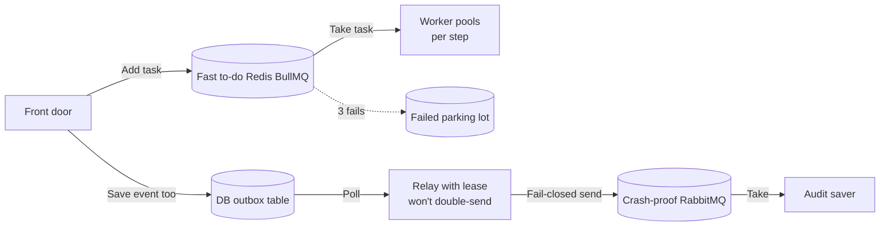

- **Fast list (BullMQ):** retries, ER first, speed cap, web board. Chain auto-starts next step.
- **Crash-proof list (RabbitMQ):** even if power cuts, audit event not lost. Pattern from `FhirBridgeAI`.
- STT 2 at once (GPU small), validation 20 at once (CPU easy). Try 3 times, wait 1s→2s→4s + random. Park after 3 → human replays.

### 10.2 Memory Shortcuts — 4 Layers

| Layer | Where | Keeps how long | What saved | Why |
|-------|-------|----------------|------------|-----|
| L1 pocket | App memory 1000 items | 5m | Form shapes, safety rules | <1ms, no trip |
| L2 nearby | Redis | 1h-24h | `voice hash → text`, `code → valid?`, `form` | Skip repeat voice typing, instant dictionary |
| L3 edge | CloudFront/Nginx | 1d | Web pages, Hindi/Tamil fonts | Fast open |
| L4 index | DB index | — | Jobs by status | Fast `who is waiting?` |

```
voice-hash + reader + version -> written text, 7 days
snomed-code + dictionary-date -> valid?, 30 days
er_discharge v2.1.0 -> form JSON, 1 hour (forget on publish)
```
Keys use hash, never patient words. Dictionary update at night → forget old `validate:*`.

### 10.3 Speed Limits — 5 Layers

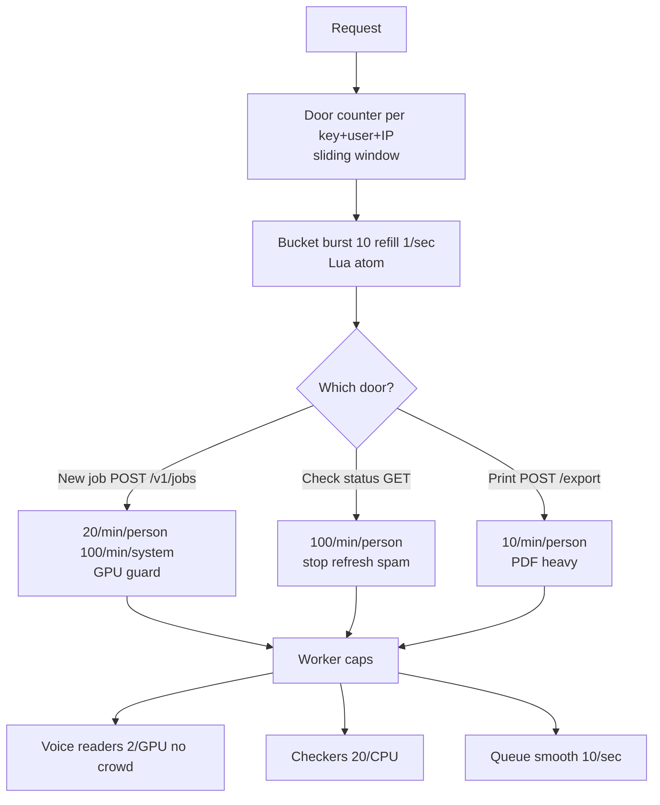

```python
# Count this minute + burst bucket
key = f"rl:{api_key}:{minute}"
count = redis.incr(key); redis.expire(key, 60)
if count > 20: raise 429  # too fast
bucket = redis.eval(LUA_TOKEN_BUCKET, keys=[f"bucket:{api_key}"], args=[1, 10, 1])
```

Too fast reply `429`:
```json
{"error": "RATE_LIMITED", "message": "20/min exceeded", "retry_after": 42, "limit": 20}
```
Headers tell `limit / left / wait seconds`.

### 10.4 Safety Nets

| Net | Where | Setting in plain |
|---------|-------|--------|
| Retry | all workers | 3 tries, wait longer each + random |
| Breaker | voice/PDF/dictionary | 5 fails/min → rest 30s → try one → use backup |
| Separate pools | per step | voice 2, finder 4, checker 20 |
| Time cap | per step | clean 10s, voice 60s, find 10s, check 5s, print 20s |
| No duplicates | door + workers | unique header + ticket UNIQUE + Redis lock |
| Health ping | all boxes | `is DB alive? is PDF alive? is dictionary alive?` |
| Gentle stop | workers | Finish current job on shutdown, then exit (30s grace) |
| Shed load | door | queue >1000 → `503 try later`, add workers |

Auto-grow: watch `waiting count + slowness + GPU full`. Cloud min 3 max 50 workers, grow if >50 waiting 30s, shrink if <10 for 5m. Local: `compose --scale worker=4`.

---

## 11. API Documentation

> **Plain English:** Doors other software (HIS) uses. Docs auto-made at `/api/docs`. Login via doctor token or hospital key. Repeat-safe via unique ID.

### Terms in this section
| Term | What it means |
|------|---------------|
| **OpenAPI 3.1 `/api/docs` + `/openapi.json` + Postman + `/v1` + `Sunset`** | Click-test docs auto-made. `/v1` version, old works 12mo, `Sunset` warns retiring. |
| **JWT `Bearer` / `X-API-Key hospital_id` / `Idempotency-Key uuid`** | Doctor token / system password per hospital / repeat-safe ID (double-send = same ticket). |
| **`job_id` + `{stage,percent,eta}` + GREEN/YELLOW/RED + 403** | Ticket ID, progress, box colors, 403 = not approved no print. `PATCH` fix → re-check logged. `verify {reviewer_id}` blocked if RED. `webhook job.verified/exported` auto-call. |
| **Webhook `HMAC-SHA256`** | Proves call is really us: `X-Signature` hash of secret+message. |
| **Gotenberg `.../libreoffice/convert` → PDF/A + Noto Devanagari/Tamil (no □) vs Puppeteer drift** | Go service owns LibreOffice version → DOCX→long-life PDF, embeds Hindi/Tamil fonts. Backup `libreoffice --headless`. Better than Puppeteer (Chrome 152 vs 149 fight + 66MB + Node 22.17). Also `FHIR JSON` for EHR + presigned 1h links. |
| **Audit append-only (no UPDATE/DELETE) + WORM 30d/7y + OTEL trace → Tempo/Jaeger + redact + Sentry** | Log can't edit. Raw locked 30d, finals 7y. One ID trails 8 steps (time viewer), numbers→Prometheus, logs scrubbed no text, crashes queued offline. |

**Docs:** `GET /api/docs` (click-test page) + `GET /api/openapi.json` + Postman file. Version `/v1`, old works 12 months, `Sunset` warns.

### 11.1 Doors

| How | Address | What it does in plain | Login | Repeat-safe |
|--------|----------|------|------|------------|
| POST | `/v1/jobs` | New ticket: send voice + form + language + store? | Doctor/System | ✅ |
| GET | `/v1/jobs/{id}` | Where is it? `{step, %, minutes left}` | Doctor/System | — |
| GET | `/v1/jobs/{id}/transcript` | Read written text + word times + sure% | Doctor/System | — |
| GET | `/v1/jobs/{id}/fields` | See boxes + GREEN/YELLOW/RED | Doctor/System | — |
| PATCH | `/v1/jobs/{id}/fields` | Fix one box → re-check, logged | Doctor/System | ✅ |
| POST | `/v1/jobs/{id}/verify` | Approve `{doctor_id}`, blocked if RED | Doctor/System | ✅ |
| POST | `/v1/jobs/{id}/export?format=docx\|pdf\|json` | Print, 403 if not approved | Doctor/System | ✅ |
| GET | `/v1/templates` | List forms | Doctor/System | — |
| GET | `/v1/templates/{id}` | Get form shape | Doctor/System | — |
| POST | `/v1/templates/{id}/preview` | Test form with dummy data | Doctor/System | ✅ |
| GET | `/v1/health` | Alive? | none | — |
| GET | `/v1/metrics` | Numbers for charts | none | — |
| POST | `/v1/webhooks` | Tell me when `approved/printed` | Doctor/System | ✅ |

### 11.2 Auto-Call (webhook)

```json
POST {your_url} {
  "event": "job.verified",
  "job_id": "a1b2c3",
  "template_id": "er_discharge_v2",
  "docx_url": "https://s3.../a1b2c3.docx?presigned=1h"
}
```
Check it's us: `X-Signature: HMAC-SHA256(secret, message)`.

### 11.3 Hospital System Example

```bash
# 1. Send voice
curl -X POST https://api.medibytes.local/v1/jobs \
  -H "X-API-Key: his_abc" -H "Idempotency-Key: $(uuidgen)" \
  -F audio=@ward_recording.mp3 -F template_id=er_discharge_v2 -F language=auto
# -> {job_id: "a1b2c3", status: "queued"}

# 2. Ask where?
curl https://api.medibytes.local/v1/jobs/a1b2c3
# -> {status: "pending_review", progress: 85, fields: [...]}

# 3. Doctor approves in screen, then:
curl -X POST https://api.medibytes.local/v1/jobs/a1b2c3/verify \
  -H "X-API-Key: his_abc" -d '{"reviewer_id":"dr_sharma"}'

# 4. Print PDF
curl -X POST "https://api.medibytes.local/v1/jobs/a1b2c3/export?format=pdf" \
  -H "X-API-Key: his_abc"
# -> {pdf_url: "https://s3.../a1b2c3.pdf?presigned=1h"}
```

### 11.4 Printing (Stage 7) in Plain

- Word made directly → `s3://exports/{job_id}.docx`.
- PDF via `POST gotenberg:3000/forms/libreoffice/convert` → locked PDF. Includes Hindi/Tamil fonts so no `□□`. Backup: `libreoffice --headless --convert-to pdf`.
- Why Gotenberg service not Puppeteer browser: service owns versions, grows sideways, no Chrome 152 vs 149 fight.
- Also returns hospital JSON for EHR.

### 11.5 Proof Lock (Stage 8) in Plain

- DB log can't be edited (no UPDATE/DELETE permission).
- Files locked: raw 30d, finals 7y.
- One ID trails all 8 steps → time viewer; numbers → charts; logs scrubbed (no text stored); crashes queued offline then sent.

---

## 12. Data, Storage & Versioning

> **Plain English:** Lists in Postgres, files in MinIO/S3, voice never in DB. Every ticket remembers which AI/dictionary/form version made it, so nothing silently changes.

### Terms in this section
| Term | What it means |
|------|---------------|
| **Postgres UUID / `BRIN` / `JSONB` / `UNIQUE` / outbox `published=false`** | UUID = worldwide unique ticket. BRIN = fast by date. JSONB = flexible boxes (text/entities/colors). UNIQUE = no duplicates. Outbox waits if crash, relay sends later. `idx_jobs_status` = fast `who waits?`. |
| **Buckets raw/enhanced/exports/templates/gold + MinIO vs Garage/SeaweedFS (AGPL) + `mc mirror`** | raw voice / cleaned / finals 1h links 7y lock / designs / 600 tests. MinIO free but AGPL license worry → Apache swaps ready. `mc mirror` copies to center when online. |
| **Pinned `model_version / terminology_version (snomed/icd10/rxnorm) / template_version` + nightly check** | Ticket saves `whisper:2026.05.12 + snomed:2026-03-01… + er:2.1.0`. Nightly compare `ferroterm:/version` → alert if drift. |
| **TLS 1.3 / SSE-S3 / `pgcrypto` / RBAC / RLS `hospital_id` / BAA / VPC+NAT+WAF / `internal` net** | Scrambled travel/at rest/secret IDs. Roles doctor/nurse/admin. Row rule `see only your hospital`. BAA = cloud patient-data contract (offline needs none). Cloud private net + firewall; offline no exit. Logs never text/audio. |

### 12.1 Postgres 16 (lists + vectors)

```sql
CREATE TABLE jobs (
  id UUID PRIMARY KEY, -- ticket ID, unique worldwide
  status TEXT CHECK(status IN
    ('queued','enhancing','transcribing','extracting',
     'validating','pending_review','verified','exported','failed')),
  template_id TEXT, template_version TEXT, -- which form version
  language TEXT, -- auto|en-IN|hi-IN|ta-IN
  audio_raw_s3 TEXT, audio_enhanced_s3 TEXT, -- file addresses only, never sound bytes
  transcript_json JSONB, entities_json JSONB, validation_json JSONB, -- text + boxes + colors
  stt_provider TEXT, model_version TEXT, terminology_version TEXT, -- which AI/dictionary
  created_by TEXT, created_at TIMESTAMPTZ DEFAULT now(),
  verified_by TEXT, verified_at TIMESTAMPTZ -- who approved when
);
CREATE INDEX idx_jobs_status ON jobs(status); -- fast who is waiting?
CREATE INDEX idx_jobs_created ON jobs USING BRIN(created_at); -- fast by date

CREATE TABLE audit_logs (
  id BIGSERIAL PRIMARY KEY, job_id UUID REFERENCES jobs(id),
  field_key TEXT, -- e.g. drugs[0].dose
  original_ai_value JSONB, human_corrected_value JSONB, -- AI said vs doctor fixed
  reviewer_id TEXT, confidence FLOAT, validation_status TEXT,
  created_at TIMESTAMPTZ DEFAULT now()
);

CREATE TABLE templates (
  id TEXT, version TEXT, schema_json JSONB, layout_s3 TEXT,
  published_at TIMESTAMPTZ, PRIMARY KEY (id, version) -- never edit, only add new version
);

CREATE TABLE outbox (
  id BIGSERIAL PRIMARY KEY, aggregate_id UUID, event_type TEXT,
  payload JSONB, created_at TIMESTAMPTZ DEFAULT now(), published BOOLEAN DEFAULT false
  -- unsent events wait here if crash, relay sends later
);
```

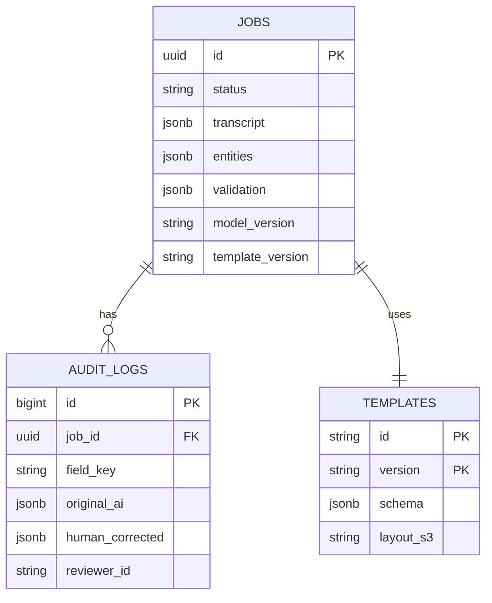

### 12.2 File Boxes (locked where needed)

```
s3://medibytes-raw/       # raw voice, encrypted, locked 30d; empty if no-store used RAM
s3://medibytes-enhanced/  # cleaned voice
s3://medibytes-exports/   # final Word/PDF, 1-hour links, locked 7y hospital record
s3://medibytes-templates/ # Word designs
s3://medibytes-gold/      # 600 perfect test audios v1.2
```
Local: `minio:latest` box + `mc mirror` copy when internet returns. License-safe swap: Garage/SeaweedFS ready (MinIO AGPL worry).

### 12.3 No Silent Change (version pin)

Every ticket saves `AI version` (e.g. `whisper-large-v3-int8:2026.05.12`), `dictionary date` (`snomed:2026-03-01`, `icd10cm:2024`, `rxnorm:2026-04-15`), `form version` (`er_discharge:2.1.0`). Nightly compare dictionary date vs saved → alert if different.

### 12.4 Safety Locks (HIPAA/PHI) in Plain

- Scrambled in travel (TLS 1.3) + at rest (SSE-S3) + secret IDs scrambled (`pgcrypto`).
- You see only your hospital (`RLS` row rule).
- Internet vendors sign BAA paper; offline needs none.
- Logs never contain text/audio; 7-year keep for finals. No-internet network has no exit; cloud uses private network + firewall.

---

## 13. Pipeline Open Questions & Risks

> **Plain English:** What still worries us + what we do about it.

### Terms in this section
| Term | What it means |
|------|---------------|
| **`FLAG_*` + Unleash + `GET /v1/flags`** | Switches no restart: reader per hospital/lang, `ta_support on/off`, `diarization on/off`, `human_gate_strict` (YELLOW blocks vs only RED). |
| **Shadow → Canary 5→25→50→100% + Argo Rollouts / nginx weighted + auto-rollback >1% 5m** | Copy-test invisible → grow real users, auto-back if errors spike. Back <60s via `helm rollback` / `compose up -d :prev`. DB expand-contract (add→copy→switch→drop). New AI/dict side-by-side 1 week, dual `$validate-code`, alert `UNKNOWN_CODE` spike. Air-gap `docker save|gzip→USB→load`. |
| **L/M/H + Critical + `mcg` HIGH_RISK + fleet drift + LibreOffice race + `redact/scrub`** | Likelihood/Impact. Critical = harm/legal. `mcg` needs 2nd doctor. Drift = 1000 PCs versions differ → one fingerprint SHA + nightly check. Race = one printer per box queue one-by-one. Redact/scrub = strip patient words from logs. |
| **Metrics `queue_depth / p95 / VRAM / RED / accuracy / critical` + Grafana p50/p95/p99 + Runbooks** | Waiting count / 95% slowness / GPU memory / flags / correct / slips → charts + papers `RUNBOOK_STT_LATENCY|OOM|VALIDATION_SPIKE` (check GPU → add workers → switch reader → clear queue). |

### 13.1 Open Pipeline Questions (plain)

| # | Worry? | Plain story | Now |
|---|----------|---------|--------|
| 1 | Tamil hearing weak? | Tamil reader is preview; backup is generic Whisper. Tamil switch OFF until ≥98%. | **Blocks Tamil launch** |
| 2 | `no allergy` misread? | Simple rules miss `no`; smart CAN-BERT better but still needs 2nd eyes for allergies. | **Critical** |
| 3 | mg/mcg 1000x guard enough? | RED + double-doctor helps, but drug book must be complete. | Check rules file |
| 4 | Should YELLOW block print? | Strict = YELLOW also blocks (safer, slower). Loose = only RED blocks. | Per-hospital switch |
| 5 | Split speakers always? | Costs 2GB GPU. Only when doctor+patient talk over each other. | Switch-gated |
| 6 | Internet LLM sees patient data? | Smart cloud needs BAA + scrub; private local needs big GPU. | Depends on place |

### 13.2 Risks & Fixes (plain)

| Risk | Chance | Hurt | Fix in plain |
|------|-------|--------|------------|
| AI invents on silence | M | H | Skip silence + ignore low + block repeats |
| Tamil words worse | H | M | Backup reader, keep Tamil off |
| `no allergy` read as allergy | M | **Critical** | Smart model not rules, 2nd checker for allergies |
| MinIO license for business | L | M | Swap to Garage/SeaweedFS free license |
| 1000 PCs drift versions | H | H | One fingerprint image, USB load, nightly version check |
| PDF makers collide | M | M | One printer per box, queue one-by-one |
| Patient words leak in logs | L | **Critical** | Scrub logs, no text in logs, BAA |

### 13.3 Switches & Safe Release (plain)

```
FLAG_stt_provider: faster-whisper | deepgram | gcp   (per hospital, per language)
FLAG_ner_model: modernbert-v1 | v2
FLAG_ta_support: on | off
FLAG_diarization: on | off
FLAG_human_gate_strict: true (yellow blocks) | false (only red)
```
Change via `GET /v1/flags` + Unleash, no restart.

```
Week1 setup → Weeks2-3 core hidden Shadow 0% → Weeks4-5 checker+screen 10 doctors Canary 5%
→ Weeks6-7 languages+PDF load 1000 → Week8 crash/HIPAA/papers → Weeks9-10 grow 5%→25%→50%→100%
auto-back if mistakes >10%. No-internet: save image → USB → load.
```
Grow: Argo Rollouts or nginx weights — 5% new, compare shadow diff, auto-back if errors >1% 5m. Back in <60s. DB change: add column → copy → switch → delete old. New AI/dictionary runs side-by-side 1 week, double dictionary check, alert if unknown codes spike.

### 13.4 Watchboards in Plain

```
waiting_jobs{step="stt"} 42
step_slow_p95{step="stt", reader="faster-whisper"} 7.2
gpu_memory_used 12.3
red_flags_total 5
final_correct 0.991
danger_slips_total 0
```
Charts: slowness p50/p95/p99 per step, word errors per language, waiting count, GPU, color split. Papers: `RUNBOOK_STT_LATENCY|OOM|VALIDATION_SPIKE.md` (1-check GPU 2-add workers 3-switch reader 4-clear queue).

---

**Next for builders:** 1) Read `ARCHITECTURE.md` tool contests, 2) Read `EDGE_CASES.md` 24 failures, 3) Build `eval/harness.py` first — 99% means nothing without proof, 4) Start `docker-compose.yml` + `eval/gold` behind switches, copy-test before real users.

*End — voice bytes never touch Postgres; AI suggests, human decides, log remembers both. Hard words defined inside each section above.*
