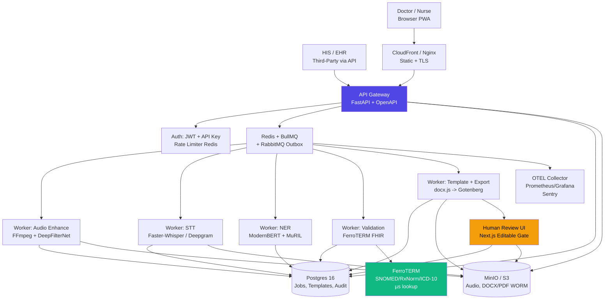
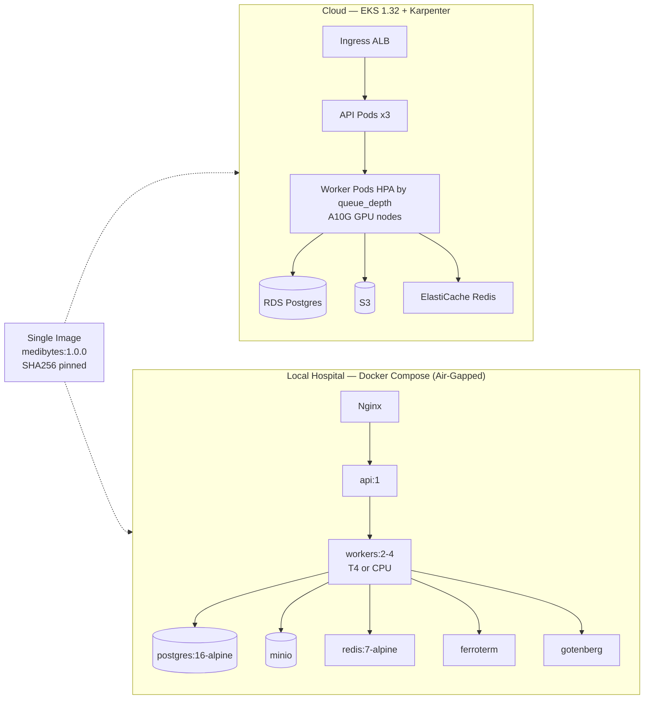
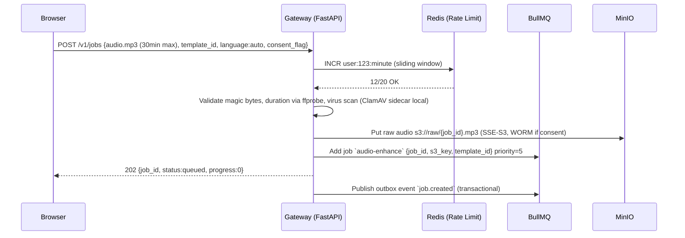
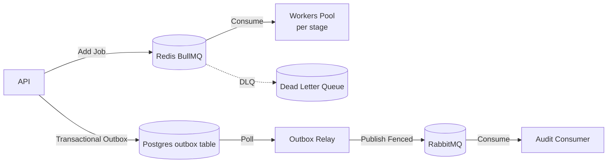
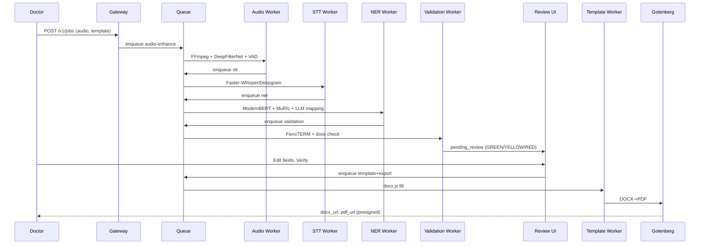
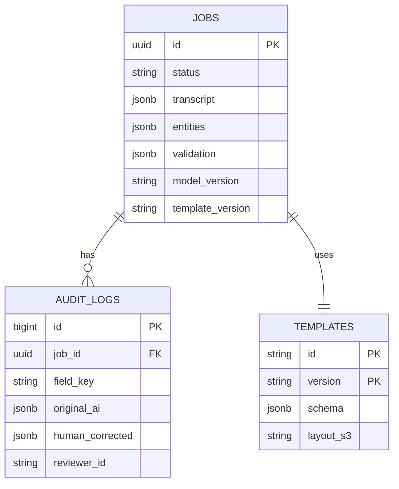

# MediBytes — L7 Production Plan: Clinical Voice-to-Template at 99% Without Breaking

> **Version:** 1.0.0 | **Date:** 2026-09-14 | **Target:** 99% Field Accuracy, 99.9% Availability, Scale 1 -> 1000 machines (Cloud + Air-Gapped Local)
> **Languages:** English (en-IN), Hindi (hi-IN), Tamil (ta-IN) + Code-Mixed (Hinglish/Tanglish)
> **Core Invariant:** `No DOCX/PDF exports until human verifies every field. AI proposes, human disposes, audit logs both.`

---

## Table of Contents
1. [Executive Summary & L7 Principles](#1-executive-summary--l7-principles)
2. [SLOs, SLIs, Error Budget](#2-slos-slis-error-budget)
3. [System Architecture Diagram](#3-system-architecture-diagram)
4. [Layered Architecture & Language Choices](#4-layered-architecture--language-choices)
5. [8-Stage Pipeline — Each Step Explainable](#5-8-stage-pipeline--each-step-explainable)
6. [Queuing, Caching, Rate Limiting, Resilience](#6-queuing-caching-rate-limiting-resilience)
7. [Multilingual Pipeline (EN/HI/TA)](#7-multilingual-pipeline-enhitacode-mix)
8. [Data, Storage, Versioning](#8-data-storage-versioning)
9. [API Design & Third-Party Integration](#9-api-design--third-party-integration)
10. [Security, HIPAA, PHI](#10-security-hipaa-phi)
11. [Scaling to 1000 Machines](#11-scaling-to-1000-machines)
12. [Testing, Evaluation & 99% Harness](#12-testing-evaluation--99-harness)
13. [Deployment — Zero-Downtime, No-Break](#13-deployment--zero-downtime-no-break)
14. [Observability, Alerting, Runbooks](#14-observability-alerting-runbooks)
15. [Cost Model](#15-cost-model)
16. [Timeline & Staffing](#16-timeline--staffing)
17. [Risks & Mitigations](#17-risks--mitigations)
18. [Appendix: Sequence Diagrams & ER](#18-appendix)

---

## 1. Executive Summary & L7 Principles

**Problem:** Doctors spend 40% time typing ER Discharge/OPD notes. Voice is faster but noisy ward audio, drug dose errors (mg vs mcg 1000x), and multilingual code-mix break naive AI. Hospitals need 99% accurate, auditable, deploy-anywhere (cloud or air-gapped local) system that scales from 1 laptop to 1000 hospital PCs.

**L7 Principles (How We Hit 99% Without Breaking Prod):**
1.  **Accuracy is an SLO with error budget.** Field Accuracy >99% is a burn-down metric, not a dashboard. CI blocks deploys if burn >10%.
2.  **99% = AI + Ontology + Human Gate.** No single model is 99%. Ensemble: `High-confidence AI (>0.95) + FHIR validation + MANDATORY editable human review`. System never auto-exports.
3.  **One Artifact, Two Planes.** Identical Docker image runs `cloud (EKS)` and `local (docker compose, no internet)` — switched by env `STT_PROVIDER`, `VALIDATOR`. No drift.
4.  **Bulkheads & Backpressure.** Each pipeline stage has isolated worker pool + queue. STT OOM cannot starve template filling. Queue depth drives autoscale.
5.  **Flag First, Ship Second.** Every model/template/terminology change behind a feature flag, evaluated in **Shadow Mode** (duplicate 10% traffic, compare, no user impact) before **Canary 5% -> 100%**.
6.  **Blast Radius = 1 Document.** Idempotent `job_id`, transactional outbox, WORM audit — one bad audio never poisons fleet.

---

## 2. SLOs, SLIs, Error Budget

| SLI | SLO | How Measured | Error Budget | Burn Action |
| :--- | :--- | :--- | :--- | :--- |
| **Field Accuracy** | **>99.0%** | `correct_fields / total_fields` on Gold 600 + live sampled (human-corrected vs AI) | 1% = 6 fields per 600 | Freeze deploys, rollback model flag |
| **Critical Error Rate** (dose/diagnosis/allergy) | **<0.1%** | Wrong drug/dose that passed validation gate | 1 per 1000 fields | Immediate canary rollback + forced re-review |
| **Availability** | **99.9%** (43m/mo downtime) | `GET /health`, `GET /v1/jobs/{id}` p95, queue consumer liveness | 0.1% | Page on-call, autoscale, circuit breaker |
| **Latency p95 (2-min audio e2e)** | **<30s** | OTEL trace `ingest -> verified` | >30s for 5m | Downgrade to `distil-large-v3` or scale workers, shed non-critical diarization |
| **Human Review Rate** | **<15% fields flagged** | `YELLOW+RED / total` | >20% for 1h | Tune thresholds, not accuracy — alert, don't rollback |

**Error budget policy:** If 99% accuracy budget burns >50% in a week, all feature deploys halt until eval harness passes. Accuracy regressions >0.2% F1 block PR merge (CI gate).

---

## 3. System Architecture Diagram

### 3.1 High-Level (C4 Level 1)



### 3.2 Deployment Topologies (Same Image)



---

## 4. Layered Architecture & Language Choices

### 4.1 Layers

```
┌─────────────────────────────────────────────────────────┐
│ Presentation Layer                                      │
│  Next.js 14 (App Router) + Tailwind + shadcn/ui + PWA  │  ← TypeScript
│  Upload (waveform), Template Gallery, Review Gate       │
├─────────────────────────────────────────────────────────┤
│ API Gateway Layer                                       │
│  FastAPI (Python 3.12) + Uvicorn + Pydantic v2        │  ← Python
│  Auth (JWT), Rate Limit, Validation, OpenAPI 3.1       │
├─────────────────────────────────────────────────────────┤
│ Service / Domain Layer                                  │
│  Python: STT, NER, Validation orchestration            │  ← Python
│  Node: Template rendering (docx.js)                    │
├─────────────────────────────────────────────────────────┤
│ Worker / Queue Layer                                    │
│  BullMQ (Redis) + RabbitMQ (outbox) + Dramatiq/Celery │  ← Python + TypeScript
├─────────────────────────────────────────────────────────┤
│ ML / Infra Layer                                        │
│  Faster-Whisper (CTranslate2), PyTorch, ONNX,           │
│  FerroTERM (Rust binary), Gotenberg (Go), FFmpeg (C)   │
├─────────────────────────────────────────────────────────┤
│ Data Layer                                              │
│  Postgres 16 (OLTP + pgvector) + MinIO/S3 + Redis      │
├─────────────────────────────────────────────────────────┤
│ Observability                                           │
│  OTEL Collector + Prometheus + Grafana + Loki + Sentry │
└─────────────────────────────────────────────────────────┘
```

### 4.2 Language Choice Rationale

| Layer | Language | Why This, Not Alternative |
| :--- | :--- | :--- |
| **Frontend** | **TypeScript + Next.js 14** | Type-safe, App Router SSR/ISR, PWA offline (service worker), `docx.js` is JS-native (no Python dep). Alternative React SPA rejected: no SSR for SEO/docs, worse offline. |
| **API Gateway** | **Python 3.12 + FastAPI** | Auto-generates OpenAPI 3.1, Pydantic validation, async `asyncio` handles 1000 concurrent uploads, native ML interop (no Node->Python IPC). Alternative Express rejected: extra bridge for ML workers. |
| **Workers — STT/NER/Validation** | **Python 3.12** | PyTorch, HuggingFace, spaCy, Faster-Whisper are Python-first. `CTranslate2` INT8 needs Python. TypeScript workers only for template/Gotenberg calls. |
| **Template Rendering** | **TypeScript (docx.js) + Python (python-docx) fallback** | `docx.js` 312KB pure JS, no Chromium, works in serverless & local. Python `python-docx` for offline batch where Node not desired. |
| **Validation Engine** | **Rust (FerroTERM binary, not code we write)** | µs lookup (89µs ICD-10, 517µs SNOMED), 40MB disk, single binary, SLSA L3. We call via HTTP `/$validate-code`, not reimplement. |
| **Export Service** | **Go (Gotenberg binary, not code we write)** | Single 665MB image wraps Chromium+LibreOffice+Pandoc, HTTP API `POST /forms/libreoffice/convert`, stateless. Avoids Puppeteer version drift (Chrome 152 vs 149). |
| **Infra Scripts** | **Bash + Python** | `ffmpeg`, `docker compose`, `mc mirror` glue. |

**Monorepo layout:**
```
/app
  /frontend        # Next.js (TS)
  /api             # FastAPI (Python)
  /workers         # Python (audio, stt, ner, validation)
  /packages/shared # JSON schemas, template JSON, OpenAPI spec
  /infra           # docker-compose.yml, k8s/, gotenberg, ferroterm
  /eval            # harness.py, gold/, metrics/
```

---

## 5. 8-Stage Pipeline — Each Step Explainable

### Stage 0: Ingest & Pre-Check (Gateway, <100ms)



**Minor details evaluated:**
- **File validation:** Check `Content-Type` + `ffprobe` magic bytes, reject `audio/*` >100MB or >30min with `413`.
- **Idempotency:** Client sends `Idempotency-Key: uuid` header, gateway stores in Redis `SETNX idempotency:{key} {job_id} EX 24h`.
- **Consent:** `consent.store_audio=false` -> skip MinIO persist, hold in `tmpfs /tmp:size=1g` encrypted, delete after STT.
- **Language hint:** `language: auto|en-IN|hi-IN|ta-IN` — `auto` triggers LID per segment.

---

### Stage 1: Audio Enhancement (Worker, 1-3s for 2min audio)

**Goal:** Noisy ward (fan, hallway, street) -> 16kHz mono studio-clear.

**Sub-steps:**
1.  **FFmpeg normalize:** `ffmpeg -i in.mp3 -ar 16000 -ac 1 -af loudnorm=I=-16:TP=-1.5:LRA=11 -c:a pcm_s16le out.wav` (<10ms).
2.  **VAD gate (Silero VAD ONNX, 5ms):** If `speech_prob <0.5` for >95% file or `duration <0.6s` -> return `NO_SPEECH` without STT (saves GPU 4-8x).
3.  **Denoise/dereverb:**
    - GPU available: `DeepFilterNet4` (Rust+ONNX, SOTA dereverb, 30MB model) — best quality.
    - CPU air-gap: `RNNoise` (Xiph, 1-2% CPU, BSD) — fallback, lighter.
    - Store both `raw` and `enhanced` in MinIO for audit (evidence).
4.  **Loudness + AGC:** `loudnorm` + auto-gain for far-field mic.
5.  **Optional diarization (pyannote 3.1, 2GB VRAM):** Only if `flag.diarization=true` — separates `SPEAKER_00/01` for doctor/patient overlap. Flag off by default (cost).

**Output:** `s3://enhanced/{job_id}.wav` + `enhancement_meta {snr_before, snr_after, vad_ratio}`.

**Failure modes & handling:** See `EDGE_CASES.md` #1-4. Empty audio -> 422 `NO_AUDIO`. Enhance OOM -> retry with RNNoise.

---

### Stage 2: STT — Speech-to-Text (Worker, 5-12s for 2min, GPU-bound)

**Pluggable engine (Flag `STT_PROVIDER`):**

| Provider | When Used | Languages | Cost | Latency (2min) |
| :--- | :--- | :--- | :--- | :--- |
| `faster-whisper:large-v3-int8` (self-host, CTranslate2) | **LOCAL default + Cloud fallback** — offline, PHI-safe | 99 langs incl. en/hi/ta, transliteration | `$0.0048/audio-hr` on L4 | 5-8s on A10G, 12s on CPU |
| `deepgram:nova-3-medical` | Cloud EN/HI premium | EN medical, `language=multi` inc HI | `$0.0043/min` | <3s (sub-300ms streaming) |
| `gcp:chirp-3` | Cloud Tamil only (ta-IN preview) | 125 langs, ta preview | `$0.016/min` | 4s |
| `whisper.cpp` | Edge Mac/ARM | Same as Whisper | Free | 10x RT on Metal |

**Steps:**
1.  Route by `STT_PROVIDER` + `detected_language` + `air_gapped` flag. Tamil -> `chirp-3` or `faster-whisper` (never Deepgram Medical EN-only).
2.  **Keyterm prompting (Deepgram):** Send 100 drug terms `["paracetamol 650mg", "azithromycin 500mg", ...]` per request — cuts missed drug rate 40%.
3.  **Decode:** `beam_size=5` (not greedy) for accuracy (+2pp, 3x slower but still <30s p95), `no_speech_threshold=0.6`, `compression_ratio_threshold=2.4`, `word_timestamps=True`.
4.  **Hallucination guard:** Filter repetition `/(thank you ){3,}/`, Silero trim silence pre-filter, cross-check confidence.
5.  **Output:** `{transcript, segments: [{text, start, end, language, confidence}], word_timestamps, detected_language}` -> Postgres `jobs.transcript_json` + MinIO.

**Why Faster-Whisper wins local:** Identical 2.7% WER to Whisper large-v3, 4-8x faster, 2.1GB VRAM INT8 vs 5GB FP16, `13.9 req/s vs 6.3`, `p50 632ms vs 1488ms` (benchmarks 2026). Runs on 8GB GPU or CPU fallback.

---

### Stage 3: Transcript Normalization (Worker, <200ms)

- **Script normalization:** If `hi-IN` detected with Roman `bukhar` and Devanagari `बुखार` mixed, normalize via `IndicXlit` or MuRIL tokenizer transliteration-pretrained path. Output keeps `original` + `normalized_en` (for ontology).
- **Number normalization:** `500 mg` vs `500mg` vs `500 मिलीग्राम` -> `500 mg` canonical + unit enum `UCUM: mg/mcg/ml/U`.
- **Code-mix tagging:** Tag per sentence `lang: en|hi|ta|mix` for downstream NER ensemble routing.

---

### Stage 4: Clinical NER — Template-Aware Entity Extraction (Worker, 1-2s)

**Ensemble (not single model) for 99%:**

```
Transcript + Template Schema (e.g., ER Discharge)
   -> BioClinical ModernBERT-large (EN clinical, 8192 ctx, 90.8% ChemProt)
   +  MuRIL-large-cased (transliteration-trained, 84.2% Hinglish F1, Tamil PANX 71.1)
   +  HingMBERT (Hinglish 77.14 F1, +3.6pp over mBERT)
   -> spaCy pipeline (tokenizer + sectionizer)
   -> NER heads per entity type:
        Drug {name, dose, unit, frequency, duration, route}
        Disease/Diagnosis {text, icd10_code, snomed_code, negated}
        Vitals {bp, hr, temp, spo2}
        Allergy {substance, reaction, negated}
        History {duration, onset}
   -> Negation/Assertion head: CAN-BERT transformer (F1 0.777, P 0.768) + MedSpaCy ConText rule fallback
      (Rule alone F1 0.492, P 0.356 — fails "no allergy" safety)
   -> LLM Mapping (stage 4b): JSON-schema constrained LLM
        Cloud: GPT-4o / Claude 3.5 Sonnet (function calling, few-shot 31% missed term cut)
        Local: Llama 3.1 70B / Qwen2.5 via vLLM/Ollama (Q4_K_M, 24GB A10G)
        Prompt: "Extract per schema, input may be HI/TA/EN mixed, output FHIR JSON, include confidence and source_sentence"
   -> Output: [{entity_text, normalized_value, unit, start, end, confidence, source_sentence, negated, language}]
```

**Template-aware:** ER Discharge extracts `Chief Complaint + Diagnosis + Drugs + Allergies + Follow-up`; Surgery Note extracts `Procedure + Anesthesia + Implants`. Schema lives in `templates/er_discharge.json` (JSON Schema), NER filters by schema `required` fields.

**Confidence per field:** Aggregate `max(token_conf) * ontology_match * llm_json_conf` -> `GREEN >0.95 / YELLOW 0.85-0.95 / RED <0.85`.

---

### Stage 5: Validation Layer — The 99% Gate (Worker, <300ms, CPU)

**Never trust NER alone. Every field validated before human sees it:**

1.  **Confidence threshold:** `RED` if `<0.85` or `null` -> blocks export.
2.  **Ontology check (FerroTERM local, µs):**
    - `GET /fhir/CodeSystem/$validate-code?system=http://snomed.info/sct&code=...`
    - `GET /fhir/ValueSet/$expand?url=http://hl7.org/fhir/ValueSet/icd-10`
    - Drug `code` must exist in RxNorm (47K prescribable subset, 1.41ms lookup), disease in SNOMED CT (600K with UMLS) or ICD-10-CM (74K).
    - If `UNKNOWN_CODE` -> `RED` + suggest Top-3 phonetic (Double Metaphone) via `/$lookup`.
3.  **Dose-range check (critical safety):**
    ```python
    if unit == "mg" and drug == "paracetamol" and dose > 4000:  # per day
        flag = "DOSE_EXCEEDED 1000x? mg vs mcg"
    if typical_unit[drug] == "mcg" and unit == "mg":
        flag = "UNIT_FLIP_WARNING 1000x — confirm mcg?"
    ```
    Rules from Lexicomp/FDB, stored in `validation_rules.json`. Blocks export until human confirms via checkbox.
4.  **Numerical consistency:** `duration * frequency * dose == total_spoken ?` e.g., `500mg x 2/day x 5 days = 5000mg` — mismatch -> `YELLOW`.
5.  **Negation check:** If `negated==true` (e.g., "no allergy to penicillin") -> do NOT extract as allergy, badge `NEGATED (0.92)`.
6.  **Schema validation:** Missing `required` field -> `REQUIRED_MISSING` RED.

**Output:** `validation_results [{field, status:GREEN/YELLOW/RED, checks_passed, message, suggested_fix}]` -> Postgres.

---

### Stage 5b: MANDATORY Human Review Gate (Frontend + API, Human Time ~30-60s)

**Invariant:** `POST /v1/templates/{id}/export` returns `403` if `job.status != verified`. No bypass, even for `GREEN`.

**UI: `src/ui/ReviewGate.tsx` (Next.js)**

```
┌─────────────────────────────────────────────────────────────────┐
│ Left: Audio + Transcript (synced)                              │
│  Waveform — click word -> play 3s clip (word_timestamps)       │
│  Transcript with highlights: Drug=blue, Disease=red            │
│  "Show Source" per field -> jumps to sentence + plays audio    │
├─────────────────────────────────────────────────────────────────┤
│ Center: Template Form — EVERY FIELD EDITABLE                   │
│  [Drug 1] Name [paracetamol ▼] Dose [500] Unit [mg ▼] [⚠️ mcg?]│
│           Frequency [BID ▼] Duration [5 days]                  │
│           Confidence: GREEN 0.97 | Source: "paracetamol 500mg" │
│  [+ Add Drug] [🗑 Remove]                                      │
│  Missing fields highlighted RED with ______ placeholder         │
├─────────────────────────────────────────────────────────────────┤
│ Right: Confidence Panel                                        │
│  ● GREEN (auto) 12 fields — [Accept All Green]                │
│  ● YELLOW 2 fields — "Review Yellow Only" filter               │
│  ● RED 1 field — UNIT_FLIP_WARNING (blocks export) ☑ Confirm │
│  [Save Draft]  [Verify & Export -> DOCX/PDF] (disabled if RED)│
└─────────────────────────────────────────────────────────────────┘
```

**Behaviors:**
- Inline edit: Text input, dropdown (ICD-10 search via FerroTERM `/$expand`), dose calculator widget.
- Live re-validation: On edit, re-run Stage 5 checks (<100ms) via `POST /v1/validate` debounced.
- Bulk: `Accept All Green` logs `human_accepted_green=true` but still counts as verified.
- Anti-fatigue: `HIGH_RISK` drugs (insulin, chemo, `mcg` unit) require second reviewer `reviewer_id_2` field.
- Audit: Store `original_ai_value` vs `human_corrected_value` + `reviewer_id` + `timestamp` for eval harness.
- Offline: PWA service worker caches queue, IndexedDB drafts, `POST /v1/bulk-sync` when back online.

**API:**
```
GET  /v1/jobs/{id}/review  -> {fields, validation, transcript, audio_url}
PATCH /v1/jobs/{id}/fields {field_id, value} -> re-validates
POST /v1/jobs/{id}/verify  {reviewer_id} -> status=verified (if no RED)
```

---

### Stage 6: Template Filling (Worker, <500ms)

- **Template definition:** `templates/er_discharge.json`:
  ```json
  {
    "id": "er_discharge_v2",
    "version": "2.1.0",
    "fields": [
      {"key": "chief_complaint", "type": "text", "required": true, "source_entities": ["symptom"]},
      {"key": "drugs", "type": "table", "columns": ["name","dose","unit","frequency","duration"], "source_entities": ["drug"]},
      {"key": "diagnosis", "type": "coded", "system": "http://hl7.org/fhir/sid/icd-10", "required": true}
    ],
    "layout": "er_discharge.docx.j2"
  }
  ```
- **Rendering:** `docx.js` (preferred, 312KB pure JS, no Chromium) or `python-docx` fallback — replaces `{{chief_complaint}}` with validated value, preserves styles, headers/footers, hospital logo.
- **Versioned:** `template_version` stored per `job`, old jobs render with old template (no break).

---

### Stage 7: Export — DOCX/PDF (Worker, 1-4s)

- **Primary output:** DOCX native gen (no conversion) -> `s3://exports/{job_id}.docx`.
- **PDF (if requested):** `POST http://gotenberg:3000/forms/libreoffice/convert` with DOCX -> PDF/A. Gotenberg handles fonts (embed `Noto Sans Devanagari` + `Noto Sans Tamil` to avoid `□` glyphs), PDF/A compliance, merge. Fallback `libreoffice --headless --convert-to pdf` if Gotenberg unavailable (air-gap without Docker).
- **Why Gotenberg not Puppeteer:** Puppeteer `66MB npm + Chrome 152 vs sparticuz 149 drift + Node 22.17 req` — Gotenberg owns version alignment as HTTP service, scales horizontally, webhook.
- **Output:** `docx_url`, `pdf_url` (presigned S3, 1h), `json_url` (FHIR resources for EHR).

---

### Stage 8: Audit & Evidence (Async, <100ms)

- **Postgres:** `audit_logs {job_id, stage, model_version, terminology_version, original_ai_value, human_corrected_value, reviewer_id, timestamp}` — immutable, append-only.
- **MinIO/S3 WORM:** Raw audio, enhanced audio, DOCX/PDF with `Object Lock` (compliance mode, 30d or per `consent`).
- **OTEL:** Trace `trace_id` across 8 stages, stage timings -> Tempo/Jaeger, metrics -> Prometheus.

---

## 6. Queuing, Caching, Rate Limiting, Resilience

### 6.1 Queuing — BullMQ + RabbitMQ (Hybrid)



**Why two queues:**
- **BullMQ (Redis):** Job queue — fast, JS-native, retries, rate limiting, priority, UI (`bull-board`), scheduled jobs. Good for `audio-enhance -> stt -> ner` pipeline with `flow` (BullMQ Flows).
- **RabbitMQ:** Transactional outbox — healthcare-grade durability, `publish fencing` (fail-closed if lease lost), exactly-once audit. Pattern from `FhirBridgeAI`: Postgres `outbox` table + relay with `lease renewal` ensures no PHI lost on crash.

**Config:**
```typescript
// BullMQ per-stage queues with bulkheads
new Queue('stt', { connection: redis, defaultJobOptions: {
  attempts: 3, backoff: {type: 'exponential', delay: 1000},
  removeOnComplete: 100, removeOnFail: 1000
}});
// Concurrency per worker type
new Worker('stt', processor, { concurrency: 2, limiter: {max: 10, duration: 1000}}); // GPU-bound
new Worker('validation', processor, { concurrency: 20 }); // CPU-bound
```
- **Priority:** ER jobs `priority=1`, routine `priority=5`.
- **DLQ:** After 3 attempts -> `dlq` queue, alert, manual replay via `POST /v1/admin/dlq/{id}/retry`.
- **Flow:** `FlowProducer` creates `audio-enhance -> stt -> ner -> validation` chain with `parent` dependency — downstream auto-triggered.

### 6.2 Caching — Multi-Layer

| Cache | Store | TTL | What | Why |
| :--- | :--- | :--- | :--- | :--- |
| **L1: In-memory** | Node `LRU 1000` | 5m | Template JSON, validation rules | <1ms, no Redis roundtrip |
| **L2: Redis** | Redis 7 | 1h-24h | `stt:{audio_hash}` (transcript), `validate:{code}` (ontology), `template:{id}` | Avoid re-STT same audio, µs ontology |
| **L3: CDN** | CloudFront / Nginx | 1d | Static frontend, `Noto Sans` fonts | Edge latency |
| **L4: Postgres query cache** | `pg_stat` | — | `jobs` by `status` index | `BRIN` on `created_at` |

**Cache keys:**
```
stt:sha256:{audio_sha}:provider:{provider}:version:{model_version} -> transcript JSON, TTL 7d
validate:snomed:{code}:version:{snomed_version} -> bool, TTL 30d
template:er_discharge:v2.1.0 -> JSON, TTL 1h (invalidated on publish)
```

**Invalidation:** Terminology nightly sync -> `DEL validate:*`; template publish -> `PUBLISH invalidate template:{id}` via Redis PubSub.

**No PHI in cache keys:** `audio_sha` is hash, not audio.

### 6.3 Rate Limiting — Token Bucket + Sliding Window

**Layers:**
1.  **Gateway (Redis):** Per `API Key` + `user_id` + `IP`
    ```python
    # Sliding window counter (precise)
    key = f"rl:{api_key}:{minute}"
    count = redis.incr(key); redis.expire(key, 60)
    if count > 20: raise 429  # 20 req/min per key
    # Token bucket for burst
    bucket = redis.eval(LUA_TOKEN_BUCKET, keys=[f"bucket:{api_key}"], args=[1, 10, 1]) # refill 1/sec, burst 10
    ```
2.  **Per-endpoint limits:**
    | Endpoint | Limit | Reason |
    | :--- | :--- | :--- |
    | `POST /v1/jobs` (upload) | 20/min per user, 100/min per API key | GPU-bound, prevent flood |
    | `GET /v1/jobs/{id}` | 100/min per user | Polling |
    | `POST /v1/export` | 10/min per user | Gotenberg heavy |
3.  **Worker concurrency limits:** `stt` max 2 concurrent per GPU node (VRAM), `validation` 20 concurrent (CPU).
4.  **Global queue throttling:** BullMQ `limiter: {max: 10, duration: 1000}` per worker — smooth bursts.
5.  **Response headers:** `X-RateLimit-Limit`, `X-RateLimit-Remaining`, `Retry-After` on 429.

**Response on 429:**
```json
{"error": "RATE_LIMITED", "message": "20/min exceeded", "retry_after": 42, "limit": 20}
```

### 6.4 Resilience — Minor Steps Evaluated

| Pattern | Where | Config |
| :--- | :--- | :--- |
| **Retry + Exponential Backoff** | All workers | `attempts=3, delay=1s*2^attempt` + jitter |
| **Circuit Breaker** | STT providers, Gotenberg, FerroTERM | `pybreaker` — open after 5 failures/60s, half-open after 30s, fallback to next provider |
| **Bulkhead** | Per-stage worker pools | `stt` 2 threads, `ner` 4, `validation` 20 — isolation |
| **Timeout** | Per stage | `audio-enhance 10s, stt 60s, ner 10s, validation 5s, export 20s` — `asyncio.wait_for` |
| **Idempotency** | API + Workers | `Idempotency-Key` header + `job_id` dedup in Postgres `UNIQUE` + Redis `SETNX` |
| **Healthchecks** | All containers | `HEALTHCHECK CMD pg_isready -U medibytes` (Postgres), `curl -f http://localhost:3000/health` (Gotenberg), `curl -f http://ferroterm:8080/health` |
| **Graceful Shutdown** | Workers | `SIGTERM` -> stop polling, finish in-flight job, ack, exit 0 (K8s `terminationGracePeriodSeconds: 30`) |
| **Backpressure** | Queue | `queue_depth >1000` -> return `503 + Retry-After` on ingest, auto-scale workers |

---

## 7. Multilingual Pipeline (EN/HI/TA/Code-Mix)

**Reality:** "Patient ko fever hai, give paracetamol 500mg BID 3 din tak" — single sentence mixes 3 languages + Roman Hindi.

**Flow:**
```
Audio (hi-IN + en mix) 
  -> LID per segment (Whisper LID or GCP auto) -> [hi-IN 0.8, en 0.2] 
  -> STT with language=multi (Deepgram) or large-v3 auto
  -> Transcript: "Patient ko fever hai, give paracetamol 500mg BID 3 din tak" (Roman + Devanagari mix preserved)
  -> Normalization: IndicXlit transliteration -> "Patient ko bukhar hai..." -> normalized_en "Patient has fever, give paracetamol 500mg BID for 3 days"
  -> NER ensemble: MuRIL (transliteration-pretrained) handles "bukhar" == "बुखार" == "fever" as same entity
  -> Ontology: lookup on normalized_en "fever" -> SNOMED 386661006
  -> UI: Show original transcript + extracted field in output language (EN default, toggle HI/TA)
```

**Models:**
- **STT:** `Faster-Whisper large-v3` (99 langs, handles Roman HI) as base; cloud premium `Deepgram Nova-3 general multi` includes HI (Medical is EN-only); `GCP Chirp 3` for `ta-IN` (preview — fallback to Whisper for Tamil).
- **NER:** `MuRIL-large-cased` (trained on transliterated pairs for 17 Indian langs, Hinglish F1 84.2% vs XLM-R 79.2%); `HingMBERT` (77.14 F1 Hinglish, +3.6pp over mBERT); `Tamil MuRIL` (PANX 71.1).
- **LLM mapping prompt:** "Input may be Hindi/Tamil/English mixed in Roman or Devanagari/Tamil script. Extract per JSON schema. Normalize doses to UCUM, diseases to ICD-10. Output English for ontology but preserve original_text."

**Evaluation split:** WER/F1 reported separately per `en-IN / hi-IN / ta-IN / mix` — must pass each >98% F1, not just average.

---

## 8. Data, Storage, Versioning

### 8.1 Postgres 16 Schema (Core)

```sql
-- jobs: single source of truth
CREATE TABLE jobs (
  id UUID PRIMARY KEY, status TEXT CHECK(status IN ('queued','enhancing','transcribing','extracting','validating','pending_review','verified','exported','failed')),
  template_id TEXT, template_version TEXT,
  language TEXT, -- auto|en-IN|hi-IN|ta-IN
  audio_raw_s3 TEXT, audio_enhanced_s3 TEXT,
  transcript_json JSONB, entities_json JSONB, validation_json JSONB,
  stt_provider TEXT, model_version TEXT, terminology_version TEXT,
  created_by TEXT, created_at TIMESTAMPTZ DEFAULT now(),
  verified_by TEXT, verified_at TIMESTAMPTZ
);
CREATE INDEX idx_jobs_status ON jobs(status); -- for queue poll
CREATE INDEX idx_jobs_created ON jobs USING BRIN(created_at);

-- audit: immutable, append-only, powers 99% metrics
CREATE TABLE audit_logs (
  id BIGSERIAL PRIMARY KEY, job_id UUID REFERENCES jobs(id),
  field_key TEXT, original_ai_value JSONB, human_corrected_value JSONB,
  reviewer_id TEXT, confidence FLOAT, validation_status TEXT, created_at TIMESTAMPTZ DEFAULT now()
);
-- templates versioned, never mutated
CREATE TABLE templates (
  id TEXT, version TEXT, schema_json JSONB, layout_s3 TEXT, published_at TIMESTAMPTZ,
  PRIMARY KEY (id, version)
);
-- outbox for transactional events
CREATE TABLE outbox (
  id BIGSERIAL PRIMARY KEY, aggregate_id UUID, event_type TEXT, payload JSONB, created_at TIMESTAMPTZ DEFAULT now(), published BOOLEAN DEFAULT false
);
```

### 8.2 MinIO / S3 Buckets (WORM where needed)

```
s3://medibytes-raw/         # raw audio, SSE-S3, Object Lock 30d, lifecycle delete after 30d if consent.allow_store=false
s3://medibytes-enhanced/    # denoised wav
s3://medibytes-exports/     # docx/pdf, presigned 1h, WORM 7y for medical record
s3://medibytes-templates/   # docx layouts
s3://medibytes-gold/        # gold dataset v1.2 (versioned)
```

**Local:** `minio: latest` container, `mc mirror` to S3 when internet available. Garage/SeaweedFS as AGPL-free alt.

### 8.3 Version Pinning

Every `job` row stores `model_version` (e.g., `whisper-large-v3-int8:2026.05.12`), `terminology_version` (`snomed:2026-03-01`, `icd10cm:2024`, `rxnorm:2026-04-15`), `template_version` (`er_discharge:2.1.0`). No silent drift — nightly job checks `ferroterm:/terminology/version` vs pinned, alerts if mismatch.

---

## 9. API Design & Third-Party Integration

**OpenAPI 3.1 at `GET /api/docs` (Swagger UI) + `GET /api/openapi.json` + Postman collection.**

**Auth:** `Authorization: Bearer <JWT>` (user) or `X-API-Key: <key>` (HIS). JWT issued by `POST /auth/login`, API keys scoped per hospital `hospital_id`.

**Idempotency:** All `POST` accept `Idempotency-Key: <uuid>` header.

**Key Endpoints:**

```
POST   /v1/jobs                          # Create job: multipart audio + template_id + language + consent
GET    /v1/jobs/{id}                     # Poll status + progress {stage, percent, eta}
GET    /v1/jobs/{id}/transcript          # Transcript with word_timestamps + confidence
GET    /v1/jobs/{id}/fields              # Extracted fields + validation GREEN/YELLOW/RED
PATCH  /v1/jobs/{id}/fields              # Edit field (triggers re-validation, audited)
POST   /v1/jobs/{id}/verify              # Human verify (requires reviewer_id, blocks if RED)
POST   /v1/jobs/{id}/export?format=docx|pdf|json  # Export (403 if not verified)
GET    /v1/templates                     # List templates
GET    /v1/templates/{id}                # Get schema
POST   /v1/templates/{id}/preview        # Preview with sample data
GET    /v1/health                        # Liveness
GET    /v1/metrics                       # Prometheus
POST   /v1/webhooks                      # Register webhook for job.verified, job.exported
```

**Webhook:** `POST {url} {event: job.verified, job_id, template_id, docx_url (presigned)}` with `X-Signature: HMAC-SHA256` verification.

**Versioning:** URL versioning `/v1`, backward compat 12 months, `Sunset` header on deprecated.

**Rate limits in headers:** `X-RateLimit-Limit: 20`, `X-RateLimit-Remaining: 12`, `Retry-After: 42`.

**Example flow (HIS integration):**
```bash
curl -X POST https://api.medibytes.local/v1/jobs \
  -H "X-API-Key: his_abc" -H "Idempotency-Key: $(uuidgen)" \
  -F audio=@ward_recording.mp3 -F template_id=er_discharge_v2 -F language=auto
# -> {job_id: "a1b2c3", status: "queued"}

curl https://api.medibytes.local/v1/jobs/a1b2c3
# -> {status: "pending_review", progress: 85, fields: [...]}

# Human reviews in UI, then:
curl -X POST https://api.medibytes.local/v1/jobs/a1b2c3/verify -H "X-API-Key: his_abc" -d '{"reviewer_id":"dr_sharma"}'
curl -X POST https://api.medibytes.local/v1/jobs/a1b2c3/export?format=pdf -H "X-API-Key: his_abc"
# -> {pdf_url: "https://s3.../a1b2c3.pdf?presigned=1h"}
```

---

## 10. Security, HIPAA, PHI

- **Encryption:** TLS 1.3 in transit (ALB + Nginx), SSE-S3 (MinIO) or S3-SSE at rest, Postgres `pgcrypto` for `reviewer_id` PII.
- **PHI minimization:** `consent.store_audio=false` -> tmpfs only, `audio_raw_s3=null`. Logs scrub PHI via `sentry scrub` + OTEL `redact` processor.
- **AuthZ:** RBAC `roles: doctor, nurse, transcriber, admin` + `hospital_id` isolation (RLS on Postgres `WHERE hospital_id = current_setting('app.hospital_id')`).
- **BAA:** Cloud providers (AWS, Azure, Deepgram enterprise, GCP) signed BAA for PHI; local mode needs no BAA (data never leaves).
- **Audit:** WORM MinIO Object Lock, Postgres `audit_logs` append-only (no UPDATE/DELETE grants), `terminology/version` pinned, 7-year retention for exports.
- **Network:** Local air-gap: `docker network internal` (no egress), Cloud: VPC private subnets + NAT, WAF on ALB.

---

## 11. Scaling to 1000 Machines

### 11.1 Fleet vs Central

| Model | Architecture | When | Cost (1000 machines) |
| :--- | :--- | :--- | :--- |
| **Fleet (1000 desktops in hospitals)** | 1000x `docker compose` (api+2 workers+postgres+minio+redis+ferroterm+gotenberg per hospital) + central replica (async `mc mirror` + `pg replication`) | Each hospital isolated, offline-first, no single point of failure | ~$0 (uses existing hospital PCs, T4 optional) |
| **Central (1000 concurrent jobs)** | EKS 1.32 + Karpenter (78-85% binpack) or AKS (7% cheaper) — `A10G 24GB` nodes for STT+LLM, `L4 $0.60/hr` for STT-only, HPA on `queue_depth` | Single hospital system, burst scaling | `$127k/mo ECS` vs `$148k EKS` vs `$162k GKE` vs `$182k Autopilot` for 1000 m7g.16xlarge (benchmark 2026) |

**L7 choice:** Fleet for 1000 hospital PCs (most hospitals), Central K8s only if >5 servers in one DC. Both use same image.

### 11.2 Autoscaling

- **Metric:** `queue_depth` (BullMQ `waiting` count) + `p95_latency` + `GPU VRAM`.
- **K8s HPA:** `min 3, max 50 workers` — scale out if `queue_depth >50` for 30s, scale in if `<10` for 5m. `Karpenter` bin-packs nodes (78-85% util).
- **Local:** `docker compose --scale worker=4` manual or `Portainer` webhook.

### 11.3 Offline-First Fleet

- Edge records + enhances + runs `Faster-Whisper small` (draft <2s) immediately for responsiveness.
- Async ships to central `large-v3` or cloud `Deepgram` when internet available via `Outbox Relay` -> `RabbitMQ` -> `MinIO` evidence buckets.
- `docker save medibytes:1.0.0 | gzip > medibytes.tar.gz` -> USB -> `docker load` in air-gap (CipherSwarm pattern). Model updates same.

---

## 12. Testing, Evaluation & 99% Harness

### 12.1 Testing Pyramid

```
Unit (80%, <100ms):      Dose calc, regex mg/mcg, transliteration, template Jinja2, FHIR $validate mocks, rate limit Lua
Contract (10%):           OpenAPI schema tests (schemathesis), Pact HIS, Gotenberg byte compare, MinIO presign
Integration (8%):         Full pipeline on 10 gold audios per commit (Testcontainers: Postgres+MinIO+Redis), Test GPU runner
E2E Shadow (1%):          Duplicate 10% live traffic to vNext workers, diff logged, no user impact — gates canary
Load/Chaos (1%):          k6 1000 concurrent, GPU OOM injection (kill -9 worker), network partition (iptables), LibreOffice race
Clinical Pilot (gate):    100 live cases, senior doctor adjudication, measure correction rate — must be >99% to GA
```

### 12.2 99% Evaluation Harness (`eval/harness.py`)

```python
# Runs in CI, blocks merge if regression
gold = load_gold("s3://medibytes-gold/v1.2") # 600 audios, double-annotated
results = run_pipeline(gold.audios) # with pinned model_version
metrics = {
  "wer": wer(results.transcripts, gold.transcripts), # target <3%
  "medical_wer": wer_on_drugs_only(...), # <2%
  "ner_f1": f1(results.entities, gold.entities, strict=True), # >0.98 critical
  "field_accuracy": correct_fields / total_fields, # >99%
  "critical_error_rate": wrong_dose_or_diagnosis / total_fields, # <0.1%
}
assert metrics["field_accuracy"] >= 0.99, "BLOCKED: accuracy dropped"
assert metrics["critical_error_rate"] < 0.001, "BLOCKED: safety"
# Split by language
for lang in ["en-IN","hi-IN","ta-IN","mix"]:
    assert metrics_by_lang[lang]["ner_f1"] > 0.98, f"BLOCKED: {lang}"
```

**CI gate:** GitHub Actions `eval` job on `pull_request` — fails if `ΔF1 < -0.2%` or `field_accuracy <99%`.

**Gold dataset:** 600 audios, 200 per language, stratified by `noise (clean/noisy)` + `accent` + `template`. Stored WORM, versioned, updated quarterly. Adjudicated by 2 clinicians.

---

## 13. Deployment — Zero-Downtime, No-Break

### 13.1 Flag System

Every risky change behind flag (Unleash or `config/flags.json`):

```
FLAG_stt_provider: faster-whisper | deepgram | gcp  (per hospital, per language)
FLAG_ner_model: modernbert-v1 | v2
FLAG_ta_support: on | off
FLAG_diarization: on | off
FLAG_human_gate_strict: true (blocks export on YELLOW) | false (only RED)
```

Evaluated via `GET /v1/flags` + `Unleash SDK`, no redeploy.

### 13.2 Release Train

```
Week 1: Scaffolding — compose + OpenAPI + gold collection
Weeks 2-3: Core pipeline behind FLAG OFF in prod, Shadow 0%
Weeks 4-5: Validation + Human Gate, dogfood 10 doctors, Canary 5% live
Weeks 6-7: Multilingual + Gotenberg, flag per hospital, load 1000 jobs
Week 8: Hardening — chaos, HIPAA, runbooks, on-call
Weeks 9-10: GA — Canary 5% (2d) -> 25% (2d) -> 50% (2d) -> 100%, auto-rollback if SLO burn >10%
Air-gap ship: docker save | gzip -> USB -> docker load
```

**Canary:** Argo Rollouts (K8s) or `nginx weighted upstream` (Compose) — 5% traffic to `vNext`, compare `field_accuracy` shadow diff, auto-rollback if `error_rate >1%` for 5m.

**Rollback:** `helm rollback` or `docker compose up -d medibytes:prev` <60s. DB migrations expand-contract (add column -> backfill -> switch -> drop).

### 13.3 Safe Model/T terminology Updates

- New model `whisper-large-v3-int8:2026.06` deployed as `FLAG_stt_provider=shadow` — runs side-by-side, logs diff, no user impact for 1 week.
- Terminology `snomed:2026-03` -> `2026-06` via `ferroterm: reload` with `version-uri` check, `/$validate-code` dual-run, alert if `UNKNOWN_CODE` spike.

---

## 14. Observability, Alerting, Runbooks

### 14.1 Metrics (Prometheus `/metrics`)

```
medibytes_queue_depth{queue="stt"} 42
medibytes_stage_latency_p95{stage="stt", provider="faster-whisper"} 7.2
medibytes_gpu_vram_used 12.3
medibytes_validation_flags_total{status="RED"} 5
medibytes_field_accuracy 0.991
medibytes_critical_errors_total 0
```

Grafana dashboards: per-stage p50/p95/p99, per-language WER, queue depth, GPU, validation breakdown.

### 14.2 Tracing & Logging

- **Tracing:** OTEL `trace_id` across 8 stages -> Tempo/Jaeger, `job_id` + `model_version` baggage.
- **Logging:** Structured JSON `{"level":"info","job_id":"a1b2","stage":"stt","provider":"faster-whisper","latency_ms":7200}` — no PHI, `redact` processor scrubs `transcript`.
- **Error tracking:** Sentry (offline capture -> relay when online), grouped by `stage` + `error_code`.

### 14.3 Alerting (PagerDuty)

| Alert | Threshold | Action |
| :--- | :--- | :--- |
| SLO burn 99% accuracy | `field_accuracy <0.99` for 10m | Page, freeze deploys |
| Critical error | `critical_errors_total >0` in 5m | Page, rollback canary |
| Queue depth | `>1000` for 5m | Scale workers, shed diarization |
| GPU OOM | `>3/hour` | Circuit breaker to `distil-large-v3`, scale A10G |
| STT latency p95 | `>30s` | Downgrade beam, autoscale |

### 14.4 Runbooks (`/infra/runbooks/`)

- **RUNBOOK_STT_LATENCY.md:** 1) `nvidia-smi` 2) `kubectl scale deploy/worker-stt --replicas=10` 3) flip `FLAG_stt_provider=faster-whisper` 4) drain queue `bull-board`.
- **RUNBOOK_OOM.md:** 1) check `dmesg` 2) `INT8` vs `FP16` toggle 3) fallback `distil-large-v3`.
- **RUNBOOK_VALIDATION_SPIKE.md:** 1) check `ferroterm:/health` 2) reload terminology 3) compare `version-uri`.

---

## 15. Cost Model (1000-machine fleet vs central)

| Component | Fleet (1000 desktops, local) | Central (1000 concurrent, cloud) |
| :--- | :--- | :--- |
| Compute | $0 (existing PCs) + optional T4 $0.35/hr per hospital | EKS 50x A10G $1.20/hr = $43k/mo + Karpenter savings 15% |
| S3/MinIO | MinIO free self-host | S3 $0.023/GB + egress $0.01/GB (~$200/mo for 1TB) |
| STT | Faster-Whisper free (self-host) | Deepgram $0.0043/min * 1000*2min*30d = $258/mo vs AWS Medical $4500/mo |
| LLM | Llama 70B self-host (A10G) | GPT-4o $5/1M tokens ~$300/mo |
| Total | **~$500/mo** (if self-host) | **~$44k/mo** central GPU cluster (autoscaled, not always 1000) |

Hybrid tiered routing saves 10-20%: route only noisy/Tamil to premium STT.

---

## 16. Timeline & Staffing

| Phase | Duration | Staff | Deliverable |
| :--- | :--- | :--- | :--- |
| 0 Scaffolding | 1w | 1 L7 + 1 FE | compose, OpenAPI, gold kickoff |
| 1 Core Pipeline | 2w | 2 BE + 1 ML | audio+stt+ner+validation shadow |
| 2 Human Gate | 2w | 1 FE + 1 BE | Review UI, audit, dogfood |
| 3 Multilingual+Export | 2w | 1 ML + 1 BE | HI/TA, Gotenberg, load test |
| 4 Hardening | 1w | 1 SRE + 1 L7 | chaos, HIPAA, runbooks |
| 5 GA Canary | 2w | all | 5%->100% rollout |
| **Total** | **10 weeks** | **4-5 engineers** | **99% GA** |

---

## 17. Risks & Mitigations

| Risk | Likelihood | Impact | Mitigation |
| :--- | :--- | :--- | :--- |
| Whisper hallucination on silence | M | H | VAD gate + `no_speech_threshold` + repetition filter |
| Tamil WER lags (preview) | H | M | Faster-Whisper fallback, flag off TA until >98% F1 |
| Negation false positive "no allergy" | M | **Critical** | CAN-BERT not NegEx, second reviewer for allergies |
| MinIO AGPL license for prod | L | M | Garage/SeaweedFS Apache alt ready |
| Fleet drift (1000 desktops) | H | H | Single image SHA, `docker save/load`, version endpoint, nightly drift check |
| LibreOffice concurrency race | M | M | Gotenberg owns lock, single LibreOffice per container, queue serializes |
| PHI leak via logs | L | **Critical** | OTEL redact, Sentry scrub, no transcript in logs, BAA for cloud |

---

## 18. Appendix

### 18.1 Sequence: End-to-End



### 18.2 ER Diagram (Simplified)



### 18.3 File Layout

```
/PRODUCTION_PLAN_L7.md  # this file
/ARCHITECTURE.md        # deep tool comparisons, infra sizing
/EDGE_CASES.md          # 24 edge cases standalone
/IDEA.md                # product definition (linked)
```

---

**Next Steps for Builders:**
1. Read `ARCHITECTURE.md` for tool bake-off tables (Whisper vs Deepgram vs Chirp, FerroTERM vs Snowstorm).
2. Read `EDGE_CASES.md` for 24 failure modes and tool-tied fixes.
3. Implement `eval/harness.py` first — 99% is meaningless without it.
4. Start with `docker-compose.yml` + `eval/gold` — pipeline behind flags, shadow before canary.

*End of L7 Plan — Ready for implementation without breaking prod.*
