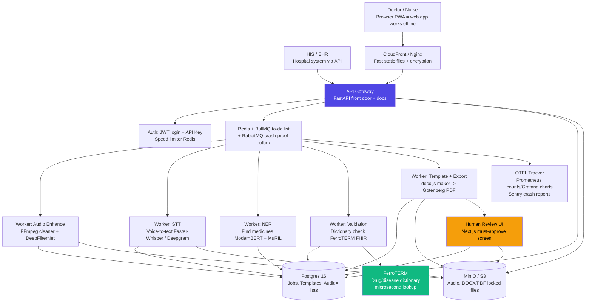
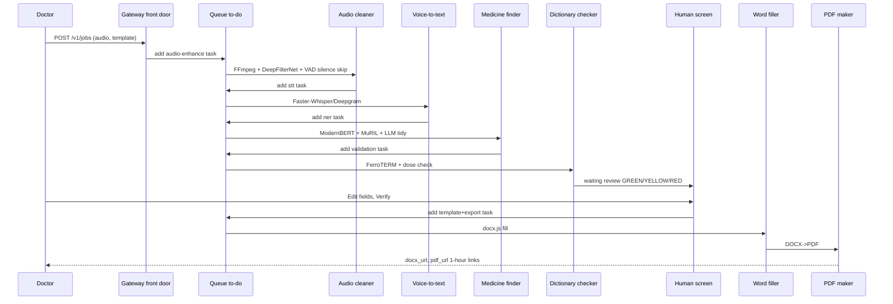
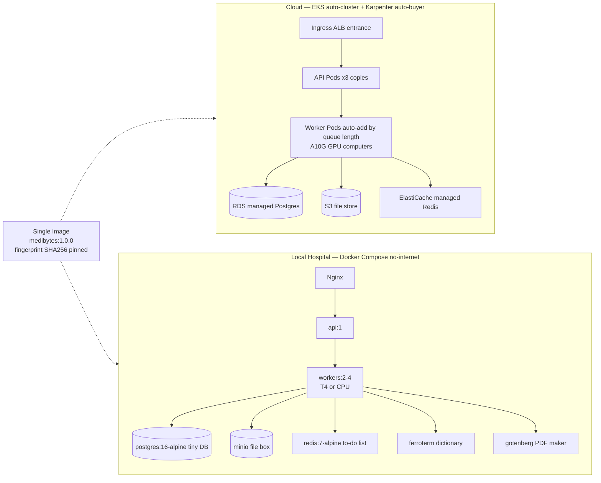
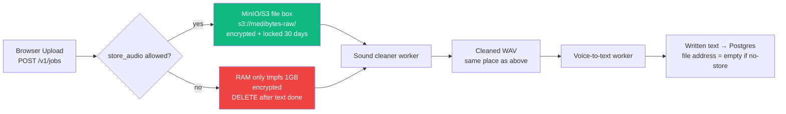
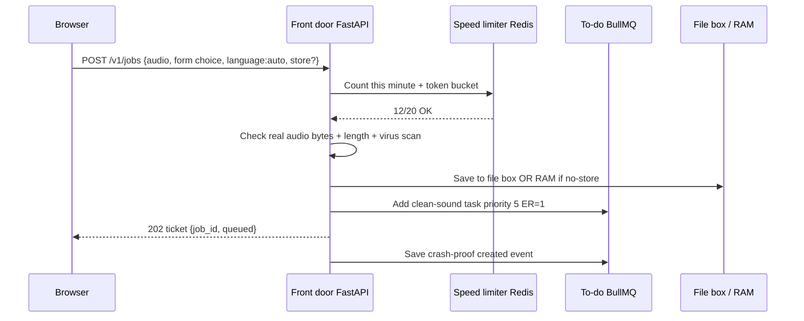
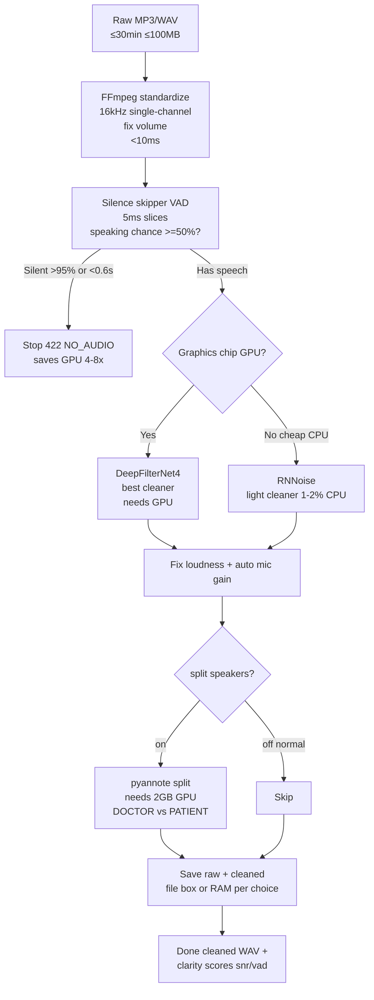
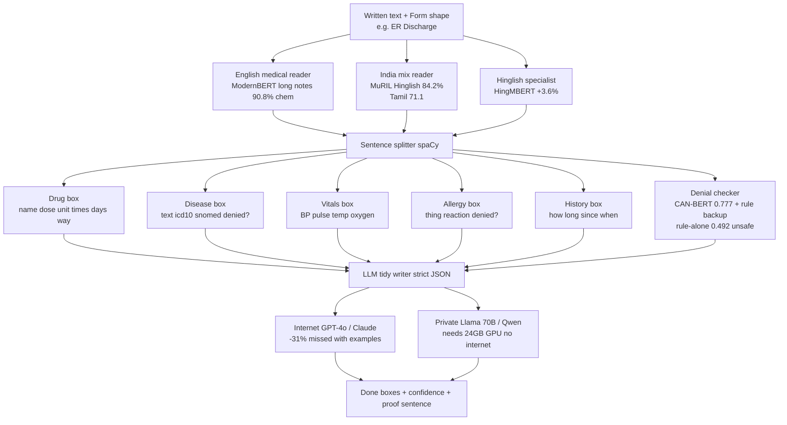
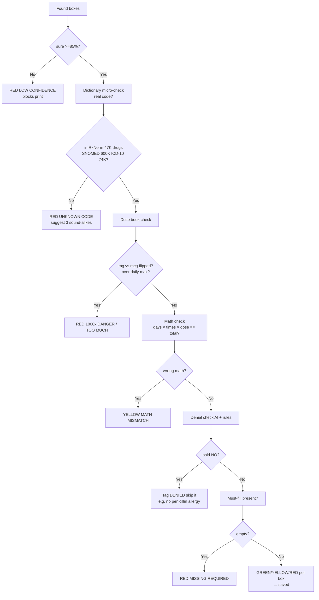
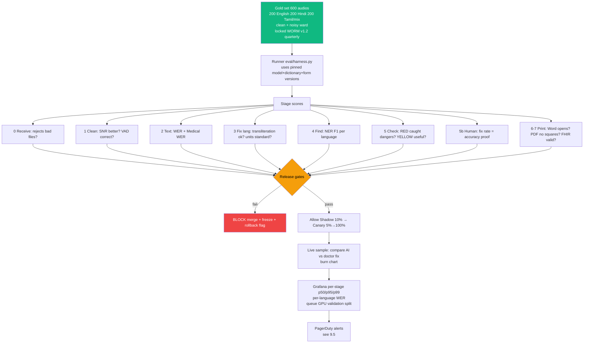

# MediBytes — Pipeline Architecture Detailed Report
> Source: `PRODUCTION_PLAN_L7.md` v1.0.0 (2026-09-14) | Target: 99% Field Accuracy, 99.9% Availability, 1 → 1000 machines
> Languages: en-IN, hi-IN, ta-IN + Hinglish/Tanglish code-mix | Core Invariant: **No DOCX/PDF exports until human verifies every field.**

> **How to read this doc:** Every section starts with a **Plain-English line** + a **Terms in this section** table. Technical names stay, but each is defined where you meet it. If you are non-technical, read only the **> Plain English** boxes + term tables + diagrams.

---

## Table of Contents
1. [Executive Summary](#1-executive-summary)
2. [End-to-End Pipeline Architecture](#2-end-to-end-pipeline-architecture)
3. [8-Stage Pipeline Overview](#3-8-stage-pipeline-overview)
4. [Voice & Audio Pipeline → STT (No DB Storage)](#4-voice--audio-pipeline--stt-no-db-storage)
5. [LLM Extraction / Clinical NER](#5-llm-extraction--clinical-ner)
6. [Template System](#6-template-system)
7. [Validation — The 99% Gate](#7-validation--the-99-gate)
8. [Human Review Gate (Mandatory)](#8-human-review-gate-mandatory)
9. [Evaluation Metrics Architecture — Whole Pipeline](#9-evaluation-metrics-architecture--whole-pipeline)
10. [Queuing, Caching, Rate Limiting, Resilience](#10-queuing-caching-rate-limiting-resilience)
11. [API Documentation](#11-api-documentation)
12. [Data, Storage & Versioning](#12-data-storage--versioning)
13. [Pipeline Open Questions & Risks](#13-pipeline-open-questions--risks)

---

## 1. Executive Summary

> **Plain English:** Doctors talk, system types the discharge note, checks drug dangers, human approves in ~1 minute, then gives Word + PDF.

### Terms in this section
| Term you will meet | What it means — what it does |
|------|------------------------------|
| **SLO (promise) / SLI (measure) / Error budget / Burn** | SLI = what we count (accuracy). SLO = promise (>99%). Budget = allowed mistakes (1% = 6 per 600). Burn = using budget too fast → freeze features. |
| **Field Accuracy** | % final boxes doctor didn't fix. `594/600 = 99%`. The promise we sell. |
| **Ensemble** | Mix of models, not one. No single AI reaches 99%. |
| **Docker image `medibytes:1.0.0`** | One sealed box with all code. Same box runs on cloud + hospital PC. |
| **Bulkhead** | Separate worker pools per step so one slow step can't sink others — like ship compartments. |
| **Shadow / Canary / Flag (Unleash)** | Flag = on/off switch no restart. Shadow = new model on 10% copy, invisible. Canary = 5% real → 25% → 50% → 100%, auto-back if bad. |
| **Blast radius = 1 document** | One bad audio hurts only itself. Via unique `job_id` + crash-proof outbox + locked audit. |
| **WORM audit** | Write Once Read Many — log can't be edited. Legal proof. |

**Problem:** Doctors spend 40% time typing ER Discharge/OPD notes. Ward audio is noisy, drug dose errors (mg vs mcg = 1000x) are fatal, and Hinglish/Tanglish code-mix breaks naive AI.

**L7 answer — 99% = AI + Dictionary + Human Gate:**
1. **Accuracy is a promise (SLO)**, not a dashboard. Code release blocked if Field Accuracy < 99%.
2. **No single AI is 99%.** Mix: confident AI (>0.95) + medical dictionary check + MANDATORY editable human review. Never auto-exports.
3. **One box, two places.** Same Docker image `medibytes:1.0.0` runs on internet cloud and no-internet hospital PC. Switched by `STT_PROVIDER`, `VALIDATOR`.
4. **Separate workers per step.** STT crash can't block printing.
5. **Switch first, ship second.** Test on copy (Shadow 10%) → 5% real users → 100%.
6. **One bad audio hurts only itself.** Unique `job_id` + crash-proof outbox + unchangeable audit.

---

## 2. End-to-End Pipeline Architecture

> **Plain English:** Doctor/HIS → front door → to-do lists → 5 workers → dictionary checker → human screen → Word/PDF maker. Everything watched.

### Terms in this section
| Term | What it means |
|------|---------------|
| **PWA (Browser PWA)** | Web app that works offline, installable like an app. |
| **HIS / EHR** | Hospital computer system that stores patient records. Talks to us via API. |
| **CDN (CloudFront / Nginx) + TLS** | Fast worldwide file server + encryption in travel. Serves web pages quickly. |
| **API Gateway (FastAPI + Uvicorn + Pydantic + OpenAPI)** | Front door. Checks login, limits speed, checks inputs, auto-makes docs. Python because AI libraries are Python-first. |
| **JWT / API Key** | JWT = doctor login token. API Key = hospital system password (`hospital_id` scoped). |
| **Worker** | Background computer doing one stage so uploads never wait. |
| **BullMQ (Redis) + RabbitMQ + Outbox** | BullMQ = fast to-do list (retries, ER-first priority, UI board). RabbitMQ + Postgres outbox table + relay = crash-proof list, no record lost even on power cut. |
| **Postgres 16** | Main list database: jobs, forms, logs. |
| **MinIO / S3 + WORM** | File boxes for voice/Word/PDF. WORM = locked, can't edit/delete (raw 30d, finals 7y). |
| **FerroTERM + SNOMED / RxNorm / ICD-10 + FHIR** | FerroTERM = tiny Rust dictionary checker (microseconds). RxNorm = 47K drugs, SNOMED = 600K diseases, ICD-10 = 74K billing codes. FHIR = hospital data standard. |
| **Next.js Review UI** | Must-approve screen. No approve = no print. |
| **OTEL / Prometheus / Grafana / Sentry** | OTEL = job tracker across 8 steps. Prometheus = counters. Grafana = charts. Sentry = crash reporter (patient words scrubbed). |

### 2.1 High-Level (C4 L1)



### 2.2 End-to-End Sequence



### 2.3 Deployment — Same Image, Two Planes



> Fleet (1000 PCs) = 1000x local boxes + nightly copy to center via `mc mirror` + DB copy. Big cloud cluster only if >5 servers in one building.

---

### 3.0 Consent-Based Storage Decision



| Patient choice | DB `audio_raw_s3` | Raw sound | Cleaned sound | Written text |
|---------|----------------------------|-----------|----------------|------------|
| `store=yes` | `s3://medibytes-raw/{job_id}.mp3` | File box locked 30d | File box | Text in DB ✅ |
| `store=no` | `empty` | RAM only, deleted after STT | RAM only | Text in DB ✅ |

### 4.1 Stage 0: Receive & Quick Check (<0.1s)

### Terms in this section — Stage 0
| Term | What it means |
|------|---------------|
| **ffprobe + magic bytes** | Reads real audio bytes, not file name, to reject fake files. |
| **ClamAV sidecar** | Virus scanner next to front door (local mode). |
| **413** | Error = file too big (>100MB or >30min). |
| **Idempotency-Key + SETNX EX 24h** | Unique ID per click. Double-click returns same ticket. Kept 24h in Redis. |
| **LID + `priority` + BullMQ Flow / FlowProducer** | LID = detect language per sentence. Priority ER=1 jumps queue (routine 5). Flow = auto-chain enhance→stt→ner→check. |



Rules in plain English:
- Reject `>100MB` or `>30min` with `413 too big`. Check real bytes via `ffprobe`, not just file name.
- No duplicates: `Idempotency-Key` unique ID → same ticket returned if user double-clicks. Kept 24h.
- Language hint `auto` = detect per sentence. ER tickets jump queue (`priority=1` vs `5`).

### 4.2 Stage 1: Clean Sound (1-3s)

### Terms in this section — Stage 1
| Term | What it means |
|------|---------------|
| **FFmpeg + loudnorm I=-16** | Converts any audio to 16kHz single-channel + fixes volume in <10ms. |
| **Silero VAD ONNX 5ms, speech_prob ≥0.5** | Keeps only speaking parts, skips silence/fan. If >95% silent or <0.6s → stop 422 NO_AUDIO, saves GPU 4-8x. |
| **DeepFilterNet4 (Rust+ONNX 30MB)** | Best noise+echo remover. Needs GPU. |
| **RNNoise (Xiph BSD 1-2% CPU)** | Light cleaner for cheap CPU / no-internet. Fallback if GPU crashes (OOM). |
| **AGC far-field + SNR + VAD ratio** | AGC = auto mic gain for far doctor. SNR = clarity score (higher cleaner). VAD ratio = % speaking. Saved as `enhancement_meta`. |
| **Diarization pyannote 3.1 (2GB VRAM)** | Splits DOCTOR vs PATIENT voices. OFF normal — costs GPU. Flag `flag.diarization`. |
| **OOM** | Out of Memory crash. Fix: retry light RNNoise. |



- Keep both raw + cleaned as proof (if store=yes). Crash on big GPU → retry light mode.

### 4.3 Stage 2: Voice → Text (5-12s, needs GPU)

### Terms in this section — Stage 2
| Term | What it means |
|------|---------------|
| **Faster-Whisper large-v3-int8 (CTranslate2)** | Offline voice reader. Same 2.7% error as big Whisper, 4-8x faster, needs 2.1GB GPU (vs 5GB). 13.9 jobs/s. Default local + cloud backup. |
| **Deepgram nova-3-medical / multi + GCP chirp-3 + whisper.cpp** | Deepgram medical = internet English best (<3s). `multi` includes Hindi. Chirp-3 = Tamil preview ($0.016/min). whisper.cpp = Apple Mac edge free. Never use Deepgram-medical for Tamil (English-only). |
| **VRAM (A10G / L4 / T4) + `FLAG_stt_provider`** | VRAM = GPU memory. Flag picks reader per hospital/language without restart. |
| **beam_size=5, no_speech_threshold, compression_ratio** | Try 5 guesses (+2% correct), ignore silence, block invented repeats. |
| **word_timestamps** | Each word keeps start/end time → click-word plays 3-sec clip. |
| **Keyterm prompting (100 drugs)** | Send drug list with request → 40% fewer missed drugs (`paracetamol` not `pair of seat`). |
| **Hallucination guard + WER 2.7%** | Blocks `thank you thank you…` on silence via trim + repeat filter + confidence check. WER = % words wrong. |

| Voice reader | When we use it | Languages | Cost | 2-min time |
|----------|------|-----------|------|---------------|
| `faster-whisper:large-v3-int8` | **Normal + no-internet**, private | 99 incl. en/hi/ta | $0.0048/hour on L4 GPU | 5-8s GPU, 12s CPU |
| `deepgram:nova-3-medical` | Internet English/Hindi best | English medical, `multi` incl. Hindi | $0.0043/min | <3s live |
| `gcp:chirp-3` | Internet Tamil only | 125, Tamil preview | $0.016/min | 4s |
| `whisper.cpp` | Apple Mac edge | Same as Whisper | Free | 10x realtime Metal chip |

Plain English why first row wins offline: same 2.7% word error, 4-8x faster, needs only 2.1GB GPU vs 5GB.

```python
# Accuracy settings — try 5 guesses, keep word times
beam_size = 5                    # +2% correct, still <30s promise
no_speech_threshold = 0.6        # ignore silence
compression_ratio_threshold = 2.4  # block invented repeats
word_timestamps = True           # needed so click-word plays audio
```

- **Drug hint list:** send 100 drug names each time → 40% fewer missed drugs.
- Tamil → never use Deepgram Medical (English-only). Switch per hospital/language via flag.
- Anti-invention: block `thank you thank you thank you`, trim silence first, check confidence.
- Output: `{full text, sentences with start/end/language/confidence, per-word times, detected language}` → DB text field.

### 4.4 Stage 3: Fix Languages/Units (<0.2s)

### Terms in this section — Stage 3
| Term | What it means |
|------|---------------|
| **LID per segment** | Detect `hi-IN 0.8 / en 0.2` per sentence for Hinglish `Patient ko fever hai…`. |
| **Transliteration (IndicXlit / MuRIL)** | `bukhar = बुखार = fever` → same meaning whatever script. |
| **UCUM (mg/mcg/ml/U)** | Standard unit codes. `500 मिलीग्राम` → `500 mg`. Needed for safe dose math. |
| **Code-mix tag en|hi|ta|mix + SNOMED lookup** | Tag each sentence, then look up clean English (`fever → SNOMED 386661006`) for dictionary. Screen shows original + English (HI/TA toggle). |

> **Plain English:** `Patient ko fever hai, give paracetamol 500mg BID 3 din tak` → clean English + standard units for dictionary.

```
Hinglish audio
 -> detect [Hindi 80%, English 20%]
 -> raw text keeps mix
 -> transliterate bukhar/बुखार/fever → same
 -> numbers: 500mg / 500 मिलीग्राम → 500 mg + code mg/mcg/ml/U
 -> tag each sentence en|hi|ta|mix
 -> look up fever → SNOMED 386661006
 -> screen shows original + English result (switch HI/TA)
```

---

## 5. LLM Extraction / Clinical NER

> **Plain English:** Three specialist readers + one tidy writer find drugs/diseases/vitals/allergies and return neat boxes with proof sentence + confidence.

### Terms in this section
| Term | What it means |
|------|---------------|
| **NER (find medicines)** | Finds drugs/diseases/vitals/allergies/history in text. |
| **ModernBERT-large BioClinical (8192 ctx, 90.8% ChemProt)** | English medical reader. Long-note memory. Good at `paracetamol 500mg BID`. |
| **MuRIL-large (Hinglish 84.2% vs XLM-R 79.2%, Tamil PANX 71.1)** | Google India mix reader. Understands transliterated `bukhar`. |
| **HingMBERT (+3.6pp over mBERT)** | Hindi-English mix specialist. |
| **spaCy tokenizer + sectionizer** | Splits text into words/sentences/sections before heads read. |
| **Negation CAN-BERT (F1 0.777) + ConText fallback** | Understands `no allergy = NOT allergy`. Rule-alone 0.492 unsafe → transformer required. Critical. |
| **LLM Mapping GPT-4o/Claude (cloud) vs Llama 70B/Qwen (local vLLM/Ollama Q4_K_M 24GB A10G)** | Big writer → strict hospital JSON. Cloud smarter (-31% missed with examples). Local private, needs big GPU. |
| **JSON-schema constrained + FHIR + UCUM/ICD-10** | Forces only valid fields (no prose) in hospital standard, doses standard, diseases coded. Keeps `original_text` + `source_sentence` proof. |

### 5.1 Ensemble (Not Single Model)



Instruction to LLM: *“Input may mix Hindi/Tamil/English. Fill hospital JSON. Doses to standard units, diseases to ICD-10. Output English for dictionary but keep original words.”*

### 5.2 Form-Aware Filtering
- ER Discharge looks for Complaint + Diagnosis + Drugs + Allergies + Follow-up.
- Surgery Note looks for Operation + Sleep-drug (anesthesia) + Implants.
- Form JSON tells NER which boxes are required.

### 5.3 Confidence → Color

```
score = best word confidence × dictionary hit × writer confidence
GREEN  >0.95  → looks good, bulk-approve allowed
YELLOW 0.85-0.95 → human must glance
RED    <0.85 or empty → blocks print until fixed
```

---

## 6. Template System

> **Plain English:** Template = empty hospital form + Word design. We fill boxes, keep logo/styles, remember version so old records never change shape.

### Terms in this section
| Term | What it means |
|------|---------------|
| **Template JSON (`er_discharge.json`) + `coded/text/table/date`** | Form shape. `coded` = must be real ICD-10/SNOMED code. `table` = repeat drug rows. `date` = ISO date. |
| **Layout `.docx.j2` (Jinja2)** | Word design with `{{chief_complaint}}` placeholders. |
| **Postgres PK (id,version) never mutated** | Old versions never edited, only new added. Ticket pins `er_discharge:2.1.0` so old record never changes shape. |
| **docx.js 312KB (primary) vs python-docx (fallback)** | docx.js = pure JS, no browser, serverless+local. python-docx = Python backup when no Node. |
| **s3://medibytes-templates/ + Redis PubSub invalidate + preview** | Designs in file box. Publish → broadcast `forget old template:id`. Preview with dummy patient via `POST /preview`. |

### 6.1 Definition (`templates/er_discharge.json`)

```json
{
  "id": "er_discharge_v2",
  "version": "2.1.0",
  "fields": [
    {"key": "chief_complaint", "type": "text", "required": true, "source_entities": ["symptom"]},
    {"key": "drugs", "type": "table", "columns": ["name","dose","unit","frequency","duration"], "source_entities": ["drug"]},
    {"key": "diagnosis", "type": "coded", "system": "http://hl7.org/fhir/sid/icd-10", "required": true}
  ],
  "layout": "er_discharge.docx.j2"
}
```

| Box type | Means | Check |
|------------|---------|------------|
| `text` | Free writing | must-fill + length |
| `coded` | Must be real dictionary code | FerroTERM check |
| `table` | Repeat rows (drug list) | each row checked, min/max rows |
| `date` | Calendar date ISO | real date range |

### 6.2 Versioning & Printing

```mermaid
graph LR
    Pub[Publish form] --> PG[(DB list templates<br/>key=id+version<br/>never edit old)]
    Pub --> S3[s3://medibytes-templates/<br/>Word designs with placeholders]
    PG & S3 --> Job[Ticket remembers version<br/>e.g. er_discharge:2.1.0]
    Job --> Render{Print engine}
    Render -->|main| JS[docx.js 312KB pure JS<br/>no browser needed]
    Render -->|backup| PY[python-docx<br/>no-JS offline]
    Render --> Old[Old tickets use old design<br/>never breaks]
    Pub --> Inv[Redis broadcast forget old<br/>template:id]
```



- Preview: `POST /v1/templates/{id}/preview` with dummy patient.
- Fill `{{chief_complaint}}` → real value, keep fonts/headers/logo.

---

## 7. Validation — The 99% Gate

> **Plain English:** Never trust AI alone. Every box checked: sure? real drug? safe dose? mg/mcg not flipped? math adds up? not denied? not empty?

### Terms in this section
| Term | What it means |
|------|---------------|
| **FerroTERM `$validate-code / $expand` (µs)** | Tiny Rust dictionary checker. Asks `real code? / list group?`. |
| **RxNorm 47K / SNOMED 600K / ICD-10 74K** | Drug list / disease dictionary / billing codes. Miss → RED + 3 sound-alike fixes via Double Metaphone (`parcetamol → paracetamol`). |
| **Lexicomp/FDB + `validation_rules.json` (Redis cached)** | Drug rule books: max daily dose. Powers `DOSE_EXCEEDED` + `UNIT_FLIP_WARNING 1000x` (e.g. thyroid mcg read as mg). Blocks print. |
| **Numerical consistency + Negation (CAN-BERT+ConText) + Schema required** | Math `500mg×2×5d=5000mg` mismatch → YELLOW. `no` → tag DENIED skip. Empty must-fill → RED MISSING. Output `validation_json` per box. |

### 7.1 Flow (<0.3s, cheap CPU)



### 7.2 Rules Table (plain)

| Check | What it asks | If bad | Doctor example |
|------|-------|--------|---------|
| Sure? | AI sure ≥85%? | RED blocks | unclear audio |
| Real code? | In drug/disease book? | RED + suggestions | typed `parcetamol` |
| Safe dose? | Under daily max? | RED TOO MUCH | paracetamol >4000mg/day |
| Unit flipped? | Usual `mcg` but got `mg`? | RED 1000x WARNING | thyroid 100mg → should be mcg? |
| Math ok? | `500mg x 2/day x 5d = 5000mg`? | YELLOW | spoken total differs |
| Denied? | Said `no`? | Tag DENIED, don't list as allergy | `no penicillin allergy` |
| Must-fill? | Required box filled? | RED MISSING | no diagnosis code |

```python
# Safety book (validation_rules.json, cached in Redis)
if unit == "mg" and drug == "paracetamol" and dose > 4000:
    flag = "DOSE_EXCEEDED — too much per day?"
if usual_unit[drug] == "mcg" and unit == "mg":
    flag = "UNIT_FLIP_WARNING 1000x — confirm mcg?"
```

Output saved: `[{box, color, checks passed, message, fix hint}]`.

---

## 8. Human Review Gate (Mandatory)

> **Plain English:** Doctor sees sound + text + boxes side-by-side, fixes with clicks, then presses Verify. No verify = no Word/PDF (error 403), even if all green.

### Terms in this section
| Term | What it means |
|------|---------------|
| **403 if `status != verified`** | HTTP refused — print door locked until Verify, even all-GREEN. No bypass. |
| **Waveform + word_timestamps + highlights** | Click word → hear 3 sec. Drug blue, disease red. `Show Source` jumps to sentence. |
| **FerroTERM `/$expand` dropdown + dose widget + `POST /v1/validate` debounced** | Pick ICD-10 code from search, calc dose, each typing re-checks <0.1s (waits for pause). |
| **`reviewer_id` + `reviewer_id_2` HIGH_RISK + `original_ai vs human_corrected`** | Who approved + second doctor for insulin/chemo/mcg + what AI said vs fixed + when → teaches evaluation. `Accept All Green` still counts verified. |
| **PWA service worker + IndexedDB + `POST /v1/bulk-sync`** | Offline web app: drafts on device, syncs when internet returns. |

```
┌─────────────────────────────────────────────────────────────────┐
│ Left: Sound + Text together                                    │
│  Sound wave — click word → hear 3 sec                           │
│  Colors: Drug=blue, Disease=red                                 │
├─────────────────────────────────────────────────────────────────┤
│ Middle: Form — EVERY BOX CAN BE TYPED                           │
│  [Drug 1] Name [paracetamol ▼] Dose [500] Unit [mg ▼] [⚠️ mcg?]│
│           Times [twice daily ▼] Days [5]                        │
│           Sure: GREEN 0.97 | Heard: paracetamol 500mg            │
│  [+ Add Drug] [Remove]  Empty RED shows ______                   │
├─────────────────────────────────────────────────────────────────┤
│ Right: Sure panel                                              │
│  ● GREEN 12 — [Approve all green]                               │
│  ● YELLOW 2 — Show yellow only                                  │
│  ● RED 1 — 1000x warning blocks print ☑ I confirm               │
│  [Save draft] [Verify & Print] off if RED                       │
└─────────────────────────────────────────────────────────────────┘
```

Plain behaviors:
- Type or pick ICD-10 from search + dose calculator.
- Each edit re-checks in <0.1s.
- Risky drugs (insulin, cancer, `mcg`) need second doctor ID.
- Saves `AI said vs doctor fixed + who + when` → teaches next evaluation.
- Works offline, syncs later.

API in plain:
```
GET  /v1/jobs/{id}/review  -> get boxes + checks + text + sound link
PATCH /v1/jobs/{id}/fields -> fix one box, re-check, logged
POST /v1/jobs/{id}/verify  -> approve if no RED {doctor_id}
```

---

## 9. Evaluation Metrics Architecture — Whole Pipeline

> **Plain English:** How we prove 99% is real. We keep 600 perfect examples checked by 2 doctors, run the factory on them every code change, score each step + final, block release if score drops. Live patients also sampled.

### Terms in this section — evaluation
| Term | What it means |
|------|---------------|
| **Gold set 600 (200/lang, WORM v1.2 quarterly)** | Perfect answers by 2 doctors: clean+noisy, accents, all forms. Locked versioned, refreshed 3 months. |
| **`eval/harness.py` + pinned versions** | Runner uses same AI/dictionary/form versions so scores comparable. |
| **WER / Medical WER / NER F1 strict / Field Accuracy / Critical Error / ΔF1** | WER = % words wrong (<3%). Medical WER = drug words wrong (<2%). F1 = boxes exactly right, missed+extra balanced (>98% EACH lang, not average). Field Accuracy = boxes not fixed (>99%). Critical = dangerous GREEN slips (<0.1% = 1/1000). ΔF1 = worse than last week? (>-0.2%). See 9.3 table for doctor examples. |
| **p95 / Availability 99.9% (43m/mo) / Review & Correction Rate** | p95 = 95% faster than X (<30s machine). Availability = uptime. Review rate = % flagged YELLOW+RED (<15%, tired if >20%). Correction = % doctor changed live (must >99% right in 100 pilot to launch). |
| **CI (10 gold fast) → Full 600 → Shadow 10% → Canary 5→100% → Live sample** | Fast check per PR, full nightly, copy-test invisible, grow real users auto-back if error>1% 5m, then compare AI vs fix + burn chart. Fail = block merge + freeze + rollback flag. |
| **Grafana / PagerDuty / Testcontainers / schemathesis / Pact / k6** | Grafana = charts (p50/p95/p99, WER/lang, queue/GPU, color split). PagerDuty = pages on-call. Testcontainers = throwaway DBs per test. schemathesis = API attacker. Pact = HIS contract. k6 = 1000 fake users + kill GPU + cut net + printer race. |

### 9.1 Big Picture



### 9.2 Runner (`eval/harness.py`) — What CI Actually Runs

```python
gold = load_gold("s3://medibytes-gold/v1.2")  # 600 audios, 2 doctors agreed
results = run_pipeline(gold.audios)  # same model_version + terminology_version + template_version
metrics = {
  "wer": wer(results.transcripts, gold.transcripts),            # plain: % words wrong
  "medical_wer": wer_on_drugs_only(...),                        # plain: % drug words wrong
  "ner_f1": f1(results.entities, gold.entities, strict=True),  # plain: % boxes exactly right
  "field_accuracy": correct_fields / total_fields,              # plain: % final boxes right
  "critical_error_rate": wrong_dose_or_diagnosis / total_fields # plain: % dangerous mistakes slipped
}
assert metrics["field_accuracy"] >= 0.99, "BLOCKED: accuracy dropped"
assert metrics["critical_error_rate"] < 0.001, "BLOCKED: safety"
for lang in ["en-IN","hi-IN","ta-IN","mix"]:
    assert metrics_by_lang[lang]["ner_f1"] > 0.98, f"BLOCKED: {lang}"
````